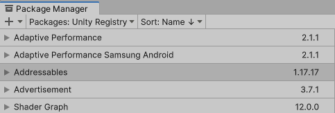
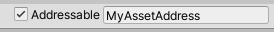
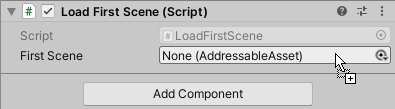
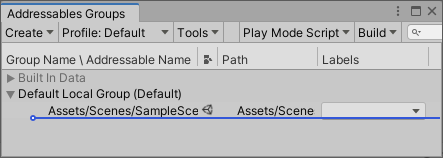
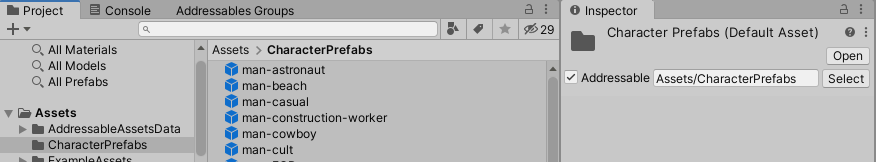
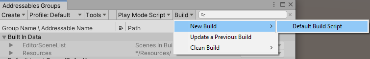

# Getting started

一旦你在你的 Unity 项目中[安装了 Addressables 包](https://docs.unity3d.com/Packages/com.unity.addressables@1.19/manual/AddressableAssetsGettingStarted.html#installation)，你就可以开始了。

使用 Addressables 的基本步骤包括：

- 使您的资产可寻址
- 使用 Addressables API 在代码中引用和加载这些资产
- 构建您的可寻址资产

参考 [Addressables-Sample](https://github.com/Unity-Technologies/Addressables-Sample) 仓库中的[Space Shooter project](https://github.com/Unity-Technologies/Addressables-Sample/tree/master/Basic/SpaceShooter)作为使用可寻址资源的的例子。

**NOTE**

*本入门主题不讨论组织可寻址内容的各种组织方式。有关该主题的信息，请参阅 [Organizing Addressable Assets](https://docs.unity3d.com/Packages/com.unity.addressables@1.19/manual/AddressableAssetsDevelopmentCycle.html#organizing-addressable-assets)。*

## Installation

要在您的项目中安装 Addressables 包，请使用 Unity 包管理器：

1. 打开包管理器（菜单：**Window > Package Manager**）。
2. 设置包列表以显示来自 **Unity Registry** 包。



3. 在列表中选择 Addressables 包。

4. 单击**Install**（在包管理器窗口的底部右侧）。

要在安装后在项目中设置可寻址系统，请打开**Addressables Groups**窗口并单击**Create Addressables Settings**。


*Before initializing the Addressables system in a Project*

当您运行**Create Addressables Settings**命令时，Addressables 系统会创建一个名为 的文件夹`AddressableAssetsData`，在其中存储设置文件和用于跟踪您的 Addressables 设置的其他资产。您应该将此文件夹中的文件添加到您的源代码控制系统。请注意，当您更改 Addressables 配置时，Addressables 可以创建其他文件。有关设置本身的更多信息，请参阅[Addressables Settings](https://docs.unity3d.com/Packages/com.unity.addressables@1.19/manual/AddressableAssetSettings.html)。

**NOTE**

*有关安装特定版本的 Addressables 的说明或有关管理项目中包的一般信息，请参阅 [Packages](https://docs.unity3d.com/2019.4/Documentation/Manual/PackagesList.html)。*

## Making an asset Addressable

您可以通过以下方式将资产标记为可寻址：

* 选中资产检查器中的**Addressable**框：



* 将资产拖动或分配到检查器中的 AssetReference 字段：



* 将资产拖入**Addressables Groups**窗口中的一个组中：



* 将资产放在标记为可寻址的项目文件夹中：



一旦您使资产可寻址，可寻址系统会将其添加到默认组中（除非您将其放置在特定组中）。当您进行[内容构建](https://docs.unity3d.com/Packages/com.unity.addressables@1.19/manual/Builds.html)时，[Addressables](https://docs.unity3d.com/2019.4/Documentation/Manual/AssetBundlesIntro.html)根据您的组设置将组中的资产打包到[AssetBundles 中](https://docs.unity3d.com/2019.4/Documentation/Manual/AssetBundlesIntro.html)。您可以使用[Addressables API](https://docs.unity3d.com/Packages/com.unity.addressables@1.19/manual/LoadingAddressableAssets.html)加载这些资产。

**NOTE**

*如果您将 [Resources folder](https://docs.unity3d.com/2019.4/Documentation/Manual/SpecialFolders.html)中的[资源](https://docs.unity3d.com/2019.4/Documentation/Manual/SpecialFolders.html)设为可寻址，Unity 会将资源移出资源文件夹。您可以将资产移动到项目中的不同文件夹，但不能将可寻址资产存储在Resources文件夹中。*

## Using an Addressable Asset

要加载可寻址资产，您可以：

- [Use an AssetReference referencing the asset](https://docs.unity3d.com/Packages/com.unity.addressables@1.19/manual/AddressableAssetsGettingStarted.html#using-assetreferences)
- [Use its address string](https://docs.unity3d.com/Packages/com.unity.addressables@1.19/manual/AddressableAssetsGettingStarted.html#loading-by-address)
- [Use a label assigned to the asset](https://docs.unity3d.com/Packages/com.unity.addressables@1.19/manual/AddressableAssetsGettingStarted.html#loading-by-label)

有关加载可寻址资产的更多详细信息，请参阅[加载](https://docs.unity3d.com/Packages/com.unity.addressables@1.19/manual/LoadingAddressableAssets.html)资产。

加载可寻址资产使用异步操作。有关在 Unity 脚本中处理异步编程的不同方法的信息，请参阅[Operations](https://docs.unity3d.com/Packages/com.unity.addressables@1.19/manual/AddressableAssetsAsyncOperationHandle.html)。

**NOTE**

*您可以在[Addressables-Sample repo](https://github.com/Unity-Technologies/Addressables-Sample) 中找到更多有关如何使用可寻址资产的示例。*

### Using AssetReferences

要使用 AssetReference，请将 AssetReference 字段添加到 MonoBehaviour 或 ScriptableObject。创建该类型的对象后，您可以将资产分配给对象的检查器窗口中的字段。

**NOTE**

*如果您将不可寻址资产分配给 AssetReference 字段，Unity 会自动将该资产设为可寻址并将其添加到您的默认可寻址组中。AssetReferences 还允许您在本身不可寻址的场景中使用可寻址资产。*

Unity 不会自动加载或释放引用的资源；您必须使用 Addressables API 加载和释放资产：

```cs
using UnityEngine;
using UnityEngine.AddressableAssets;
using UnityEngine.ResourceManagement.AsyncOperations;

public class LoadWithReference : MonoBehaviour
{
    // Assign in Editor
    public AssetReference reference;

    // Start the load operation on start
    void Start() {
        AsyncOperationHandle handle = reference.LoadAssetAsync<GameObject>();
        handle.Completed += Handle_Completed;
    }

    // Instantiate the loaded prefab on complete
    private void Handle_Completed(AsyncOperationHandle obj) {
        if (obj.Status == AsyncOperationStatus.Succeeded) {
            Instantiate(reference.Asset, transform);
        } else {
            Debug.LogError($"AssetReference {reference.RuntimeKey} failed to load.");
        }
    }

    // Release asset when parent object is destroyed
    private void OnDestroy() {
        reference.ReleaseAsset();
    }
}
```

有关[Loading an AssetReference](https://docs.unity3d.com/Packages/com.unity.addressables@1.19/manual/LoadingAddressableAssets.html#loading-an-assetreference)的更多信息，请参阅加载 AssetReference。

### Loading by address

您可以使用地址字符串加载资产：

```cs
using UnityEngine;
using UnityEngine.AddressableAssets;
using UnityEngine.ResourceManagement.AsyncOperations;

public class LoadWithAddress : MonoBehaviour
{
    // Assign in Editor or in code
    public string address;

    // Retain handle to release asset and operation
    private AsyncOperationHandle<GameObject> handle;

    // Start the load operation on start
    void Start() {
        handle = Addressables.LoadAssetAsync<GameObject>(address);
        handle.Completed += Handle_Completed;
    }

    // Instantiate the loaded prefab on complete
    private void Handle_Completed(AsyncOperationHandle<GameObject> operation) {
        if (operation.Status == AsyncOperationStatus.Succeeded) {
            Instantiate(operation.Result, transform);
        } else {
            Debug.LogError($"Asset for {address} failed to load.");
        }
    }

    // Release asset when parent object is destroyed
    private void OnDestroy() {

        Addressables.Release(handle);
    }
}
```

请记住，每次加载资产时，还必须释放它。

有关更多信息，请参阅 [Loading a single asset](https://docs.unity3d.com/Packages/com.unity.addressables@1.19/manual/LoadingAddressableAssets.html#loading-a-single-asset)。

### Loading by label

您可以在一次操作中加载具有相同标签的资产集：

```cs
using System.Collections.Generic;
using UnityEngine;
using UnityEngine.AddressableAssets;
using UnityEngine.ResourceManagement.AsyncOperations;

public class LoadWithLabels : MonoBehaviour
{
    // Label strings to load
    public List<string> keys = new List<string>() { "characters", "animals" };

    // Operation handle used to load and release assets
    AsyncOperationHandle<IList<GameObject>> loadHandle;

    // Load Addressables by Label
    void Start() {
        float x = 0, z = 0;
        loadHandle = Addressables.LoadAssetsAsync<GameObject>(
            keys, // Either a single key or a List of keys 
            addressable => {
            //Gets called for every loaded asset
            if (addressable != null) {
                    Instantiate<GameObject>(addressable,
                        new Vector3(x++ * 2.0f, 0, z * 2.0f),
                        Quaternion.identity,
                        transform);
                    if (x > 9) {
                        x = 0;
                        z++;
                    }
                }
            }, Addressables.MergeMode.Union, // How to combine multiple labels 
            false); // Whether to fail if any asset fails to load
        loadHandle.Completed += LoadHandle_Completed;
    }

    private void LoadHandle_Completed(AsyncOperationHandle<IList<GameObject>> operation) {
        if (operation.Status != AsyncOperationStatus.Succeeded)
            Debug.LogWarning("Some assets did not load.");
    }

    private void OnDestroy() {
        // Release all the loaded assets associated with loadHandle
        Addressables.Release(loadHandle);
    }
}
```

有关更多信息，请参阅 [Loading multiple assets](https://docs.unity3d.com/Packages/com.unity.addressables@1.19/manual/LoadingAddressableAssets.html#loading-multiple-assets)。

## Managing Addressable assets

要管理您的可寻址资产，请使用**Addressables Groups**窗口。使用此窗口创建可寻址组、在组之间移动资产以及为资产分配地址和标签。

当您首次安装和设置 Addressables 包时，它会为Addressables 资产创建一个默认组。Addressables系统默认将您标记为Addressables的任何资产分配给此组。在项目的早期阶段，您可能会发现将资产保留在这个单个组中是可以接受的，但是当您添加更多内容时，您应该考虑创建额外的组，以便更好地控制应用程序加载哪些资源并在任何给定时间保留在内存中。

关键组设置包括：

- Build path：内容构建后保存内容的位置。
- Load path：您的应用或游戏在运行时查找构建内容的位置。

**NOTE**

*您可以（并且通常应该）使用 Profile 变量来设置这些路径。有关详细信息，请参阅[配置文件](https://docs.unity3d.com/Packages/com.unity.addressables@1.19/manual/AddressableAssetsProfiles.html)。*

- Bundle模式：如何将群内的内容打包成bundle。您可以选择以下选项：
  - 一个包含所有组资产
  - 该组中的每个条目一个包（如果您将整个文件夹标记为可寻址并希望将它们的内容构建在一起，则特别有用）
  - 分配给组资产的每个唯一标签一个包
- 内容更新限制：适当设置此值允许您发布较小的内容更新。有关更多信息，请参阅[内容更新版本](https://docs.unity3d.com/Packages/com.unity.addressables@1.19/manual/ContentUpdateWorkflow.html)。如果您总是发布完整版本来更新您的应用程序并且不从远程源下载内容，您可以忽略此设置。

有关在决定如何组织资产时要考虑的策略的更多信息，请参阅 [Organizing Addressable assets](https://docs.unity3d.com/Packages/com.unity.addressables@1.19/manual/AddressableAssetsDevelopmentCycle.html#organizing-addressable-assets)。

有关使用 Addressables Groups 窗口的更多信息，请参阅[Groups](https://docs.unity3d.com/Packages/com.unity.addressables@1.19/manual/Groups.html)。

## Building Addressable assets

Addressables 内容构建步骤根据[组设置](https://docs.unity3d.com/Packages/com.unity.addressables@1.19/manual/GroupSettings.html)和编辑器中当前平台的[设置](https://docs.unity3d.com/Packages/com.unity.addressables@1.19/manual/GroupSettings.html)将Addressables 组中的资产转换为 AssetBundles 。

在 Unity 2021.2+ 中，您可以配置 Addressables 系统以将您的 Addressables 内容构建为每个 Player 构建的一部分，或者您可以在进行 Player 构建之前单独构建您的内容。有关配置这些选项的更多信息，请参阅[使用 Player 构建构建可寻址内容](https://docs.unity3d.com/Packages/com.unity.addressables@1.19/manual/Builds.html#build-with-player)。

如果您将 Unity 配置为作为 Player 构建的一部分构建您的内容，请使用编辑器[构建设置](https://docs.unity3d.com/2019.4/Documentation/Manual/PublishingBuilds.html)窗口上的正常**Build** 或 **Build and Run**按钮来启动构建。Unity 在构建播放器之前构建您的可寻址内容作为预构建步骤。

在早期版本的 Unity 中，或者如果您将 Unity 配置为单独构建您的内容，您必须使用**Addressables Groups**窗口上的**Build**菜单构建**Addressables**，如 [Making builds] 中所述。下次为项目构建播放器时，它会使用上次为当前平台运行的可寻址内容构建生成的工件。有关自动化 Addressables 构建过程的信息，请参阅 [构建脚本]。

要从可寻址组窗口启动内容构建：



1. 打开 Addressables Groups 窗口（菜单：**Windows > Asset Management > Addressables > Groups**）。
2. 从**Build**菜单中选择一个选项：
   - **New Build**：使用特定构建脚本执行构建。如果您没有自己的自定义脚本，请使用**Default Build Script**。
   - **Update a Previous Build**：基于现有构建构建更新。要更新之前的构建，Addressables 系统需要`addressables_content_state.bin`由早期构建生成的文件。您可以在`Assets/AddressableAssetsData/Platform`Unity 项目的文件夹中找到此文件。有关更新内容的更多信息，请参阅[Content Updates](https://docs.unity3d.com/Packages/com.unity.addressables@1.19/manual/ContentUpdateWorkflow.html)。
   - **Clean Build**：删除缓存的构建文件。

默认情况下，构建会在您的[配置文件](https://docs.unity3d.com/Packages/com.unity.addressables@1.19/manual/AddressableAssetsProfiles.html)设置中为**LocalBuildPath**和**RemoteBuildPath**变量定义的位置创建文件。Unity 用于您的播放器构建的文件包括 AssetBundles (.bundle)、目录 JSON 和哈希文件以及设置文件。

**WARNING**

*在大多数情况下，您不应更改本地构建或加载路径的默认值。如果这样做，在进行 Player 构建之前，您必须将本地构建工件从您的自定义构建位置复制到项目的[StreamingAssets](https://docs.unity3d.com/2019.4/Documentation/Manual/StreamingAssets.html)文件夹中。更改这些路径还排除了将您的可寻址对象构建为 Player 构建的一部分。*

如果您有构建到**RemoteBuildPath** 的组，则您有责任将这些 AssetBundles、目录和哈希文件上传到您的托管服务器。（如果您的项目不使用远程内容，请将所有组设置为使用本地构建和加载路径。）

内容构建还会创建 Addressables 不直接在播放器构建中使用的以下文件：

- `addressables_content_state.bin`：用于进行内容更新构建。如果您支持动态内容更新，则必须在每次内容发布后保存此文件。否则，您可以忽略此文件。
- `AddressablesBuildTEP.json`：记录构建性能数据。请参阅[Build Profiling](https://docs.unity3d.com/Packages/com.unity.addressables@1.19/manual/BuildProfileLog.html)。

有关如何设置和执行内容构建的更多信息，请参阅[Building Addressable content](https://docs.unity3d.com/Packages/com.unity.addressables@1.19/manual/Builds.html)。

### Starting a full content build

要进行完整的内容构建：

1. 在**Build Settings**窗口中设置所需的**Platform Target**。
2. 打开**Addressables Groups**窗口（菜单：**Asset Management > Addressables > Groups**）。
3. 从**Groups**窗口的 Build 菜单中选择 __ New Build > Default Build Script__ 命令。

构建过程开始。

构建完成后，您可以执行播放器构建并将任何远程文件从您的**RemoteBuildPath**上传到您的托管服务器。

**IMPORTANT**

*如果您计划在不重新构建应用程序的情况下发布远程内容更新，则必须为每个已发布的构建保留`addressables_content_state.bin`文件。如果没有此文件，您只能创建完整的内容构建和播放器构建，而不能创建更新。有关更多信息，请参阅[Content update builds](https://docs.unity3d.com/Packages/com.unity.addressables@1.19/manual/ContentUpdateWorkflow.html)。*

## Remote content distribution

您可以使用 Addressables 支持通过内容交付网络 (CDN) 或其他托管服务远程分发内容。Unity 为此提供了 Unity Cloud Content Delivery (CCD) 服务，但您可以使用任何您喜欢的 CDN 或主机。

在构建用于远程分发的内容之前，您必须：

- 在 AddressableAssetSettings 中启用**Build Remote Catalog**选项（使用菜单访问：**Windows > Asset Management > Addressables > Settings**）。
- 在用于发布内容的 [Profile](https://docs.unity3d.com/Packages/com.unity.addressables@1.19/manual/AddressableAssetsProfiles.html)配置**RemoteLoadPath**以反映您计划访问内容的远程 URL。
- 对于包含要远程交付的资产的每个 Addressables 组，将**Build Path**设置为**RemoteBuildPath**并将**Load Path 设置**为**RemoteLoadPath**。
- 在 Unity **Build Settings**窗口中设置所需的**Platform Target**。

在您进行内容构建（使用可寻址**Groups** 窗口）和播放器构建（使用**Build Settings**窗口）之后，您必须将在您的配置文件的**RemoteBuildPath**指定的文件夹中创建的文件上传到您的托管服务。要上传的文件包括：

- AssetBundles (name.bundle)
- 目录（catalog_timestamp.json）
- 哈希（catalog_timestamp.hash）

有关更多信息，请参阅[Distributing remote content](https://docs.unity3d.com/Packages/com.unity.addressables@1.19/manual/RemoteContentDistribution.html)。

## Incremental content updates

当您远程分发内容时，您可以通过发布增量内容更新版本来减少用户为更新而需要下载的数据量。增量更新构建允许您发布仅包含自上次发布更新以来发生更改的资产的远程包，而不是重新发布所有内容。这些较小的更新包中的资产会覆盖现有资产。

**IMPORTANT**

*如果您希望拥有发布增量更新的选项，则必须在发布播放器构建之前打开 [Build Remote Catalog](https://docs.unity3d.com/Packages/com.unity.addressables@1.19/manual/AddressableAssetSettings.html#catalog)选项。如果没有远程目录，已安装的应用程序不会检查更新。*

有关内容更新的更多详细信息（包括示例），请参阅 [Content update builds](https://docs.unity3d.com/Packages/com.unity.addressables@1.19/manual/ContentUpdateWorkflow.html)。

### Starting a content update build

要进行内容更新，而不是完整构建：

1. 在**Build Settings**窗口中，设置**Platform Target**以匹配您现在正在更新的先前内容构建的目标。
2. 打开**Addressables Groups**窗口（菜单：**Asset Management > Addressables > Groups**）。
3. 从**Tools** 菜单中，运行**Check for Content Update Restrictions**命令。在**Build Data File**打开浏览器窗口。
4. 找到`addressables_content_state.bin`先前构建生成的文件。此文件位于`Assets/AddressableAssestsData`文件夹中目标平台命名的子文件夹中。
5. 点击**Open**。**Content Update Preview**窗口搜索更改并标识必须移动到新组以进行更新的资产。如果您没有更改设置为“Cannot Change Post Release”的组中的任何资产，则预览中将不会列出任何更改。（当您将组中的资产更改为“Can Change Post Release”时，Addressables 会为该组重建所有 AssetBundle；在这种情况下，Addressables 不会将更改的资产移动到新组。）
6. 单击**Apply Changes**以接受任何更改。
7. 从**Build** 菜单中，运行 __  Update a Previous Build __ 命令。
8. 打开`addressables_content_state.bin`先前构建生成的文件。

构建过程开始。

构建完成后，您可以将文件从**RemoteBuildPath**上传到您的托管服务器。

**IMPORTANT**

*Addressables 使用该`addressables_content_state.bin`文件来识别您更改了哪些资产。您必须为每个已发布的构建保留此文件的副本。如果没有该文件，您只能创建完整的内容构建，而不能创建更新。*

