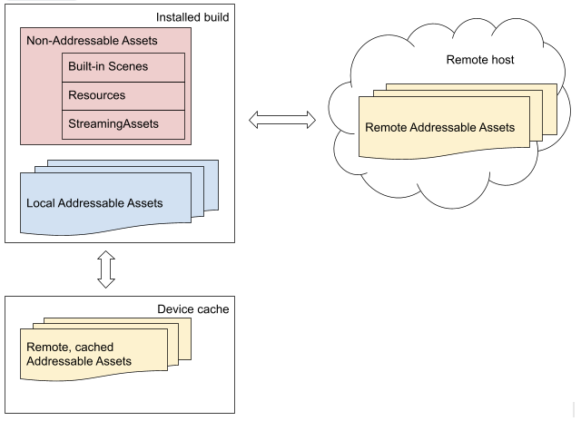

# Overview of the Addressables system

Addressables 提供了一个可以随着您的项目而增长的系统。您可以从一个简单的设置开始，然后随着项目的复杂性和团队规模的增长而重新组织，您只需更改最少的代码即可完成所有这些工作。

例如，您可以从一组可寻址资产开始，Unity 将其作为一组加载。然后，当您添加更多内容时，您可以将您的资产分成多个组，以便您可以在给定时间仅加载您需要的那些。随着团队规模的扩大，您可以制作单独的 Unity 项目来开发不同类型的资产。这些辅助项目可以生成它们自己的可寻址内容构建，您可以从主项目加载（同样以最少的代码更改）。

本概述讨论了以下概念，以帮助您了解如何通过 Addressables 系统管理和使用您的资产：

- **Asset address**：标识可寻址资产的字符串 ID。您可以使用 address 作为加载资产的 key。
- **AssetReferences**：一种类型，可用于支持将可寻址资产分配给检查器窗口中的字段。您可以使用 AssetReference 实例作为加载资产的键。该[AssetReference](https://docs.unity3d.com/Packages/com.unity.addressables@1.19/manual/AssetReferences.html)类还提供了自己的加载方法。
- **Label**：您可以分配给多个资产并用于将相关资产作为一个组一起加载的标签。您可以使用标签作为加载资产的键。
- **Asset location**：一个运行时对象，描述如何加载资产及其依赖项。您可以使用 location objects 作为加载资产的键。
- **Key**：标识一个或多个可寻址对象的对象。键包括addresses、labels、AssetReference 实例和location objects。
- **Asset loading and unloading**：Addressables API 提供了自己的功能来在运行时加载和释放资产。
- **Dependencies**：资产依赖项是一种资产被另一种资产使用，例如场景资产中使用的预制件或预制件资产中使用的材质。
- **Dependency and resource management**：Addressables 系统使用引用计数来跟踪正在使用的资产和 AssetBundle，包括系统是否应该加载或卸载依赖项（其他引用的资产）。
- **Group**：您在编辑器中将资产分配给组。组设置决定了 Addressables 如何将组资产打包到 AssetBundles 中以及它如何在运行时加载它们。
- **Content catalogs**：Addressables 使用目录将您的资产映射到包含它们的资源。
- **Content builds**：在使用 Addressables 时，在进行播放器构建之前，您可以将内容构建作为单独的步骤来整理和打包您的资产。
- **Multiple platform support**：构建系统分离平台构建的内容，并在运行时解析正确的路径。
- **Addressables tools**：Addressables 包包含多个窗口和工具，用于组织、构建和优化您的内容。

默认情况下，Addressables 使用 AssetBundles 来打包您的资产。您还可以实现自己的[IResourceProvider](https://docs.unity3d.com/Packages/com.unity.addressables@1.19/api/UnityEngine.ResourceManagement.ResourceProviders.IResourceProvider.html)类以支持其他访问资产的方式。

## Asset addresses

Addressables 系统的一个关键特性是您为资产分配地址并使用这些地址在运行时加载它们。Addressables 资源管理器在内容目录中查找地址以找出资产的存储位置。（资产可以内置到您的应用程序、本地缓存或远程托管。）资源管理器加载资产和任何依赖项，如有必要，首先下载内容。

*Addressables loads Assets by address no matter where they're located*

由于地址与资产的物理位置无关，因此在 Unity 编辑器和运行时管理和优化资产时，您具有更大的灵活性。[内容目录](https://docs.unity3d.com/Packages/com.unity.addressables@1.19/manual/AddressableAssetsOverview.html#content-catalogs)将地址映射到物理位置。

虽然您通常应该为您的资产分配唯一的地址，但资产地址不需要是唯一的。如果有用，您可以将相同的地址字符串分配给多个资产。例如，如果您有资产的变体，您可以为所有变体分配相同的地址并使用标签来区分变体：

- Asset 1: address: "plate_armor_rusty", label: "hd"
- Asset 2: address: "plate_armor_rusty", label: "sd"

仅加载单个资产的可寻址 API 函数，例如[LoadAssetAsync](https://docs.unity3d.com/Packages/com.unity.addressables@1.19/api/UnityEngine.AddressableAssets.Addressables.LoadAssetAsync.html)，如果您使用分配给多个资产相同的地址，则会加载找到的第一个实例。其他功能，如LoadAssetsAsync 在一次操作中加载多个资产，并加载具有指定地址的所有资产。

**TIP**

您可以使用 LoadAssetsAsync 的[MergeMode](https://docs.unity3d.com/Packages/com.unity.addressables@1.19/api/UnityEngine.AddressableAssets.Addressables.MergeMode.html)参数来加载两个键的交集。

在上面的示例中，您可以指定地址“plate_armor_rusty”和标签“hd”作为键和intersection作为合并模式加载“Asset 1”。您可以将标签值更改为“sd”以加载“Asset 2”。

请参阅 [Making an asset Addressable](https://docs.unity3d.com/Packages/com.unity.addressables@1.19/manual/AddressableAssetsGettingStarted.html#making-an-asset-addressable)以了解如何为资产分配地址。

有关如何通过键（包括地址）[加载资产，请参阅 [Loading assets](https://docs.unity3d.com/Packages/com.unity.addressables@1.19/manual/LoadingAddressableAssets.html)。

## AssetReference

AssetReference 是一种可以设置为任何类型的可寻址资产的类型。Unity 不会自动加载分配给引用的资源，因此您可以更好地控制何时加载和卸载它。

在 MonoBehaviours 和 ScriptableObjects 中使用 AssetReference 类型的字段来帮助您指定要用于该字段的可寻址资产（而不是使用指定地址的字符串）。AssetReferences 支持drag-and-drop和对象选择器分配，这可以使它们更方便地在编辑器检查器中使用。

除了基本的 AssetReference 类型之外，Addressables 还提供了一些更专业的类型，例如 AssetReferenceGameObject 和 AssetReferenceTexture。您可以使用这些专门的子类来消除将错误类型的资产分配给 AssetReference 字段的可能性。此外，您可以使用 AssetReferenceUILabelRestriction 属性来限制对具有特定标签的资产的分配。

有关更多信息，请参阅[Using AssetReferences](https://docs.unity3d.com/Packages/com.unity.addressables@1.19/manual/AssetReferences.html)。

## Loading and releasing assets

要加载可寻址资产，您可以使用其 address 或其他键，例如 label 或 AssetReference。有关更多信息，请参阅[Loading Addressable Assets](https://docs.unity3d.com/Packages/com.unity.addressables@1.19/manual/LoadingAddressableAssets.html)。您只需要加载主要资产；Addressables 自动加载任何依赖资产。

当您的应用程序在运行时不再需要访问可寻址资产时，您必须释放它，以便可寻址资产可以释放相关内存。Addressables 系统保留加载资产的引用计数。在引用计数归零之前，它不会卸载资产。因此，您无需跟踪资产或其依赖项是否仍在使用；您只需要确保在任何时候显式加载资产时，在应用程序不再需要该实例时将其释放。有关更多信息，请参阅 [Releasing Addressable assets](https://docs.unity3d.com/Packages/com.unity.addressables@1.19/manual/LoadingAddressableAssets.html#releasing-addressable-assets)。

## Dependency and resource management

Unity 中的一项资产可以依赖于另一项资产。一个场景可能引用一个或多个预制件；Prefab 可能使用一种或多种材料。相同的材质可以被多个预制件使用，并且这些预制件可以存在于不同的 AssetBundle 中。当您加载可寻址资产时，系统会自动查找并加载它引用的任何相关资产。当系统卸载资产时，它也会卸载它的依赖项——除非它们仍然被不同的资产使用。

当您加载和释放资产时，Addressables 系统会为每个项目保留一个引用计数。当资产不再被引用时，Addressables 将其卸载。如果资产位于不再包含任何正在使用的资产的包中，Addressables 也会卸载该包。

有关更多信息，请参阅 [Memory management](https://docs.unity3d.com/Packages/com.unity.addressables@1.19/manual/MemoryManagement.html)。

## Addressables groups and labels

使用可寻址组来组织您的内容。所有可寻址资产都属于一个组。如果您没有明确地将资产分配给一个组，Addressables 会将其添加到默认组中。

您可以设置组设置以指定 Addressables 构建系统应如何将组中的资产打包成包。例如，您可以选择是否应将组中的所有资产打包在单个 AssetBundle 文件中。

使用标签来标记要以某种方式一起处理的内容。例如，如果您为“red”、“hat”和“feather”定义了标签，则可以在一次操作中加载所有带有羽毛的红帽子，无论它们是否属于同一个 AssetBundle。此外，您可以使用标签来确定如何将组中的资产打包。

使用 **[Addressables Groups](https://docs.unity3d.com/Packages/com.unity.addressables@1.19/manual/Groups.html#groups-window)**窗口将资产添加到组并在组之间移动资产。您还可以在“组”窗口中为您的资产分配标签。

### Group schemas

分配给组的模式定义用于在组中构建资产的设置。不同的模式可以定义不同的设置组。例如，一个标准模式定义了如何将您的资产打包和压缩到 AssetBundles（以及其他选项）中的设置。另一个标准模式定义了组中的资产属于“Can Change Post Release”和“Cannot Change Post Release”中的哪一个类别。

您可以定义自己的架构以与自定义构建脚本一起使用。

见[Schemas](https://docs.unity3d.com/Packages/com.unity.addressables@1.19/manual/GroupSettings.html#schemas)有关组架构的详细信息。

## Content catalogs

Addressables 系统生成一个内容目录文件，将您的资产地址映射到它们的物理位置。Addressables 为每个项目生成一个内容目录，但您可以加载其他 Unity 项目创建的目录以加载这些项目生成的 Addressable 资产。这允许您使用单独的项目来开发和构建您的一些资产，这可以使大型制作的迭代和团队协作更容易。

当 Addressables 生成内容目录时，它还会创建一个包含目录哈希（数学指纹）的哈希文件。如果您远程托管您的可寻址资产，系统将使用此哈希文件来确定内容目录是否已更改并需要下载。

执行内容构建时选择的配置文件决定了内容目录中的地址如何映射到资源加载路径。有关详细信息，请参阅[Profiles](https://docs.unity3d.com/Packages/com.unity.addressables@1.19/manual/AddressableAssetsProfiles.html)。

有关加载内容目录的信息，请参阅[Loading additional catalogs](https://docs.unity3d.com/Packages/com.unity.addressables@1.19/manual/LoadContentCatalogAsync.html#loading-additional-catalogs)目录。

有关远程托管内容的信息，请参阅[Distributing content remotely](https://docs.unity3d.com/Packages/com.unity.addressables@1.19/manual/RemoteContentDistribution.html)。

如果要加载其他目录或覆盖默认更新行为，请参阅[Managing catalogs at runtime](https://docs.unity3d.com/Packages/com.unity.addressables@1.19/manual/LoadContentCatalogAsync.html)。

## Content builds

Addressables 系统将 Addressable 内容的构建与播放器的构建分开。内容构建会生成内容目录、目录哈希和包含您的资产的 AssetBundles。

由于资产格式是特定于平台的，因此您必须在构建播放器之前为每个平台构建内容。

有关更多信息，请参阅[Building Addressable content](https://docs.unity3d.com/Packages/com.unity.addressables@1.19/manual/Builds.html)。

## Play mode scripts

当您在编辑器播放模式下运行您的游戏或应用程序时，总是在按下播放按钮之前执行内容构建可能既不方便又缓慢。同时，您确实希望能够在尽可能接近内置玩家的状态下运行您的游戏。为了灵活性，Addressables 提供了三个选项来确定 Addressables 系统如何在 Play 模式下定位和加载资产：

- **Use the Asset database**：Addressables 直接从资产数据库加载资产。如果您同时进行代码和资产更改，此选项通常提供最快的迭代速度，但也最不类似于生产构建。
- **Simulate groups**：可寻址对象在模拟组时加载资产。如果您正在组织和优化您的可寻址组本身，则此选项很有用。它提供可寻址事件，而无需在每次更改后重新构建完整的内容。
- **Use existing build**：Addressables 从上次内容构建加载内容。此选项最类似于生产构建，如果您不更改资产，则可以提供快速迭代周转。

有关更多信息，请参阅[Play mode Scripts](https://docs.unity3d.com/Packages/com.unity.addressables@1.19/manual/Groups.html#play-mode-scripts) 。

## Support for multiple platforms

Addressables 支持为多个平台设计的项目，方法是在构建路径中包含目标平台名称，并确保在您构建播放器时将正确的平台文件复制到 StreamingAssets 文件夹。

## Addressables tools

Addressables 系统提供了一些工具和窗口来帮助您管理您的 Addressable 资产：

- [Addressable Groups window](https://docs.unity3d.com/Packages/com.unity.addressables@1.19/manual/Groups.html#groups-window)：Groups 窗口是用于管理资产、组设置和进行构建的主界面。
- [Profiles window](https://docs.unity3d.com/Packages/com.unity.addressables@1.19/manual/AddressableAssetsProfiles.html)：帮助设置构建使用的路径。
- [Addressables Event Viewer](https://docs.unity3d.com/Packages/com.unity.addressables@1.19/manual/EventViewer.html)：监视和分析与您的可寻址资产相关的运行时事件。
- [Analyze tool](https://docs.unity3d.com/Packages/com.unity.addressables@1.19/manual/AnalyzeTool.html)：分析工具运行分析规则，检查您的可寻址内容是否符合您定义的规则集。Addressables 系统提供了一些基本规则，例如检查重复资产；您可以使用[AnalyzeRule](https://docs.unity3d.com/Packages/com.unity.addressables@1.19/api/UnityEditor.AddressableAssets.Build.AnalyzeRules.AnalyzeRule.html)类添加自己的规则。
- [Hosting tool](https://docs.unity3d.com/Packages/com.unity.addressables@1.19/manual/AddressableAssetsHostingServices.html)：托管工具提供了一个简单的资产托管服务，该服务从 Unity 编辑器运行以帮助开发和测试您的项目。
- [Build layout report](https://docs.unity3d.com/Packages/com.unity.addressables@1.19/manual/BuildLayoutReport.html)：描述由内容构建生成的 AssetBundles。

