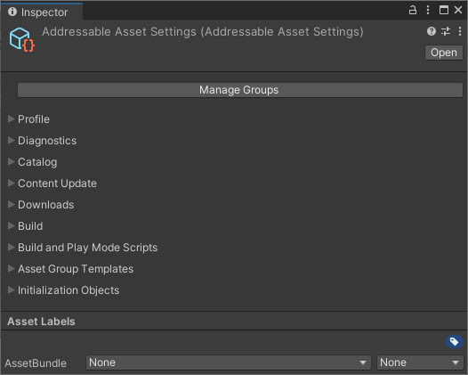
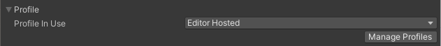
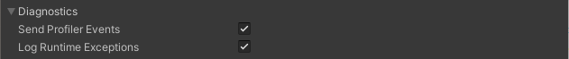
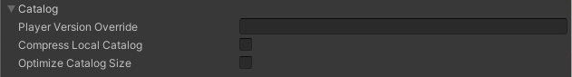
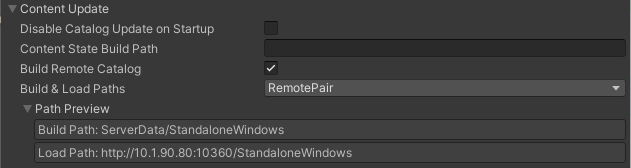
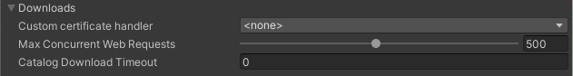
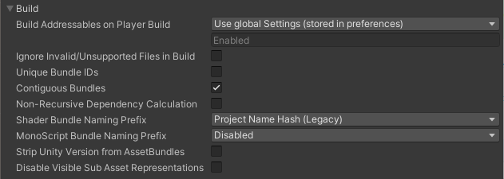
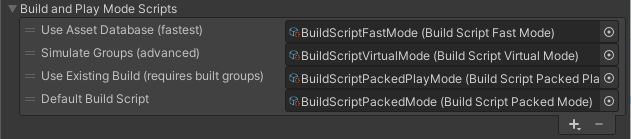
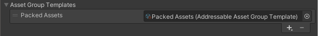
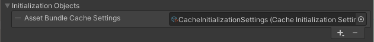

# Addressable Asset Settings

您可以访问**Addressable Asset Settings** Inspector上的主要 Addressable 系统选项（菜单：**Window > Asset Management > Addressables > Settings**）。

Addressables 系统将设置资产存储在 AddressableSettingsData 文件夹中（在您的项目资产文件夹下）。如果此文件夹尚不存在，则必须从**Groups**窗口（菜单：**Window > Asset Management > Addressables > Groups**）初始化 Addressables 系统。

*The Addressable Asset Settings Inspector*

检查器包含以下部分：

- [Profile](https://docs.unity3d.com/Packages/com.unity.addressables@1.19/manual/AddressableAssetSettings.html#profile)
- [Diagnostics](https://docs.unity3d.com/Packages/com.unity.addressables@1.19/manual/AddressableAssetSettings.html#diagnostics)
- [Catalog](https://docs.unity3d.com/Packages/com.unity.addressables@1.19/manual/AddressableAssetSettings.html#catalog)
- [Content Update](https://docs.unity3d.com/Packages/com.unity.addressables@1.19/manual/AddressableAssetSettings.html#content-update)
- [Downloads](https://docs.unity3d.com/Packages/com.unity.addressables@1.19/manual/AddressableAssetSettings.html#downloads)
- [Build](https://docs.unity3d.com/Packages/com.unity.addressables@1.19/manual/AddressableAssetSettings.html#build)
- [Build and Play Mode Scripts](https://docs.unity3d.com/Packages/com.unity.addressables@1.19/manual/AddressableAssetSettings.html#build-and-play-mode-scripts)
- [Asset Group Templates](https://docs.unity3d.com/Packages/com.unity.addressables@1.19/manual/AddressableAssetSettings.html#asset-group-templates)
- [Initialization object list](https://docs.unity3d.com/Packages/com.unity.addressables@1.19/manual/AddressableAssetSettings.html#initialization-object-list)

您可以单击**Manage Groups**按钮打开 [Groups window](https://docs.unity3d.com/Packages/com.unity.addressables@1.19/manual/Groups.html#groups-window).

## Profile

*Profile settings*

使用使**Profile in Use**列表来选择活动配置文件。活动配置文件确定可寻址构建脚本使用的变量值。

单击**Manage Profiles**按钮打开 **Profiles** 窗口，您可以在其中创建新配置文件和更改配置文件变量。

有关配置文件的更多信息，请参阅[Profiles](https://docs.unity3d.com/Packages/com.unity.addressables@1.19/manual/AddressableAssetsProfiles.html)。

## Diagnostics

*Diagnostics settings*

| Property                   | Function                                                     |
| :------------------------- | :----------------------------------------------------------- |
| **Send Profiler Events**   | 启用探查器事件。您必须启用此设置才能使用 Addressables [Event Viewer](https://docs.unity3d.com/Packages/com.unity.addressables@1.19/manual/EventViewer.html)窗口。 |
| **Log Runtime Exceptions** | 记录资产加载操作的运行时异常（除了将错误记录到 [AsyncOperationHandle.OperationException](https://docs.unity3d.com/Packages/com.unity.addressables@1.19/api/UnityEngine.ResourceManagement.AsyncOperations.AsyncOperationHandle.OperationException.html#UnityEngine_ResourceManagement_AsyncOperations_AsyncOperationHandle_OperationException) 属性）。 |

##### 提示

*默认情况下，可寻址资产仅记录警告和错误。您可以通过打开 **Player** 设置窗口（菜单：**Edit** > **Project Settings...** > **Player**），导航到**Other Settings** > **Configuration**部分，并将“ `ADDRESSABLES_LOG_ALL`”添加到**Scripting Define Symbols**字段来启用详细日志记录。*

## Catalog

*Catalog settings*

与 Addressables Catalog 相关的设置，它将资产的地址映射到其物理位置。

| Property                    | Function                                                     |
| :-------------------------- | :----------------------------------------------------------- |
| **Player Version Override** | 覆盖用于制定远程目录名称的时间戳。如果设置，远程目录名为`Catalog_<Player Version Override>.json`. 如果留空，则使用时间戳。请注意，当您为每个新构建使用唯一的远程目录名称时，您可以在同一个基本 URL 上托管多个版本的内容。如果您对每个构建使用相同的覆盖字符串，则所有玩家都将加载新目录。另请注意，玩家更新构建始终使用与其正在更新的构建相同的远程目录名称（请参阅 [Content update builds](https://docs.unity3d.com/Packages/com.unity.addressables@1.19/manual/ContentUpdateWorkflow.html)）。 |
| **Compress Local Catalog**  | 在压缩的 AssetBundle 文件中构建目录。 减少目录的存储大小，但会增加构建和加载目录的时间。 |
| *Optimize Catalog Size*     | 通过为内部 ID 创建查找表来减小目录的大小。会增加加载目录所需的时间。 |

## Content Update

*Content update settings*

控制远程内容构建和更新的设置。

| Property                              | Function                                                     |
| :------------------------------------ | :----------------------------------------------------------- |
| **Disable Catalog Update on Startup** | 当 Addressables 系统在运行时初始化时，禁用对远程目录的自动更新的检查。您可以手动[check for an updated catalog](https://docs.unity3d.com/Packages/com.unity.addressables@1.19/manual/LoadContentCatalogAsync.html#updating-catalogs). |
| **Content State Build Path**          | 在哪里构建由默认构建脚本生成的内容状态文件。                 |
| **Build Remote Catalog**              | 启用以构建远程目录。                                         |
| **Build & Load Paths**                | 在哪里构建和加载远程目录。从列表中选择一个 [Profile](https://docs.unity3d.com/Packages/com.unity.addressables@1.19/manual/AddressableAssetsProfiles.html)路径对，或者选择`<custom>`是否要分别设置构建和加载路径。 仅当您启用**Build Remote Catalog**时可见。 |
| **Build Path**                        | 在哪里构建远程目录。通常，您应该使用*RemoteBuildPath* [Profile](https://docs.unity3d.com/Packages/com.unity.addressables@1.19/manual/AddressableAssetsProfiles.html)变量。 仅当您将**Build & Load Paths**设置为`<custom>`. |
| **Load Path**                         | 访问远程目录的 URL。通常，您应该使用*RemoteLoadPath* [Profile](https://docs.unity3d.com/Packages/com.unity.addressables@1.19/manual/AddressableAssetsProfiles.html)变量。 仅当您将**Build & Load Paths**设置为`<custom>`. |

## Downloads

*Download settings*

影响目录和 AssetBundle 下载处理的设置。

| Property                        | Function                                                     |
| :------------------------------ | :----------------------------------------------------------- |
| **Custom certificate handler**  | 用于自定义证书处理的类。该列表包含项目中扩展的所有类[UnityEngine.Networking.CertificateHandler](https://docs.unity3d.com/2019.4/Documentation/ScriptReference/Networking.CertificateHandler.html). |
| **Max Concurrent Web Requests** | 系统将超出此限制的任何请求排队。                             |
| **Catalog Download Timeout**    | 等待目录文件下载的秒数。                                     |

## Build

*Build settings*

影响所有构建的设置。

| Property                                      | Function                                                     |
| :-------------------------------------------- | :----------------------------------------------------------- |
| **Build Addressables on Player Build**        | Unity 是否将 Addressables 内容构建为 Player 构建的一部分。  •**Build Addressables content on Player Build**：构建播放器时始终构建可寻址内容。  •**Do not Build Addressables content on Player Build**：在构建 Player 时切勿构建 Addressables 内容。（如果您修改 Addressables 内容，则必须在构建播放器之前手动重新构建它。）  •**Use global Settings (stored in preferences)**：使用在[Unity Editor Preferences](https://docs.unity3d.com/Packages/com.unity.addressables@1.19/manual/Configuration.html#unity-preferences) （在**Addressables**下）。  前两个选项覆盖当前项目的全局首选项并影响构建项目的所有贡献者。否则，全局的 Preferences 值适用于所有 Unity 项目。看[Building content](https://docs.unity3d.com/Packages/com.unity.addressables@1.19/manual/Builds.html#build-with-player) 想要查询更多的信息。 |
| **Ignore Invalid/Unsupported Files in Build** | 如果启用，Addressables 构建脚本会排除无效或不受支持的文件，而不是中止构建。 |
| **Unique Bundle IDs**                         | 是否在每个构建中为包生成唯一名称。看[Unique Bundle IDs](https://docs.unity3d.com/Packages/com.unity.addressables@1.19/manual/ContentUpdateWorkflow.html#unique-bundle-ids-setting) 想要查询更多的信息。 |
| **Contiguous Bundles**                        | 产生更有效的捆绑布局。如果您有由 Addressables 1.12.1 或更早版本生成的包，请禁用此选项以最小化包更改。 |
| **Non-Recursive Dependency Calculation**      | 无需递归计算依赖关系。                                       |
| **Shader Bundle Naming Prefix**               | 如何命名为 Unity 着色器生成的包。                            |
| **MonoScript Bundle Naming Prefix**           | 如何命名包含 MonoScripts 的包。                              |
| **Strip Unity Version From AssetBundles**     | 是否从包头中删除 Unity 版本。                                |
| **Disable Visible Sub Asset Representations** | 如果您不直接使用子对象（精灵、子网格等），启用此选项可缩短构建时间。 |

## Build and Play Mode Scripts

*Configured build and Play mode scripts*

配置项目中可用的[IDataBuilder](https://docs.unity3d.com/Packages/com.unity.addressables@1.19/api/UnityEditor.AddressableAssets.Build.IDataBuilder.html)脚本。如果您创建自定义构建或播放模式脚本，则必须先将其添加到此列表中，然后才能使用它。

Addressables 包包含一些构建脚本，用于处理默认构建过程并提供在播放模式下访问数据的不同方式。您可以在 AddressableAssetData/DataBuilders 文件夹中找到这些脚本。

要添加自定义脚本，请单击**+**按钮并在项目中找到您的脚本。自定义脚本必须扩展[BuildScriptBase](https://docs.unity3d.com/Packages/com.unity.addressables@1.19/api/UnityEditor.AddressableAssets.Build.DataBuilders.BuildScriptBase.html)或实现[IDataBuilder](https://docs.unity3d.com/Packages/com.unity.addressables@1.19/api/UnityEditor.AddressableAssets.Build.IDataBuilder.html)。

**NOTE**

*构建脚本和播放模式脚本都实现了**[IDataBuilder](https://docs.unity3d.com/Packages/com.unity.addressables@1.19/api/UnityEditor.AddressableAssets.Build.IDataBuilder.html)**。系统通过它们产生的结果的数据类型来区分它们。构建脚本生成**[AddressablesPlayerBuildResult](https://docs.unity3d.com/Packages/com.unity.addressables@1.19/api/UnityEditor.AddressableAssets.Build.AddressablesPlayerBuildResult.html)**，而播放模式脚本生成**[AddressablesPlayModeBuildResult](https://docs.unity3d.com/Packages/com.unity.addressables@1.19/api/UnityEditor.AddressableAssets.Build.AddressablesPlayModeBuildResult.html)**。在自定义脚本中，实现**[CanBuildData](https://docs.unity3d.com/Packages/com.unity.addressables@1.19/api/UnityEditor.AddressableAssets.Build.IDataBuilder.CanBuildData.html)**方法。*

## Asset Group Templates

*Configured group templates*

定义可用于创建新组的模板列表。创建新模板时，必须先将其添加到此列表中，然后才能使用它。

Addressables 包包含一个模板，其中包含默认构建脚本使用的模式。您可以在 AddressableAssetData/AssetGroupTemplates 文件夹中找到该模板。

要添加自定义模板，请单击**+**按钮并在项目中找到您的自定义模板资产。

有关创建自定义模板的信息，请参阅[Group templates](https://docs.unity3d.com/Packages/com.unity.addressables@1.19/manual/GroupSettings.html#group-templates)。

## Initialization object list

*Configured InitializationObjects*

配置项目的初始化对象。初始化对象是实现[IObjectInitializationDataProvider](https://docs.unity3d.com/Packages/com.unity.addressables@1.19/api/UnityEngine.ResourceManagement.Util.IObjectInitializationDataProvider.html)接口的ScriptableObject 类。您可以创建这些对象以在运行时将数据传递给 Addressables 初始化过程。

要添加初始化对象，请单击**+**按钮并在项目中找到您的初始化对象资产。

有关更多信息，请参阅[Customizing initialization](https://docs.unity3d.com/Packages/com.unity.addressables@1.19/manual/InitializeAsync.html)。

