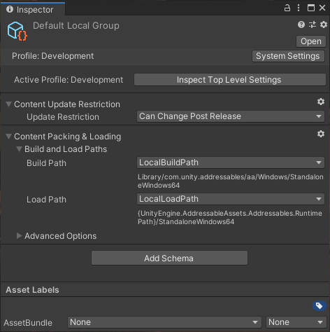
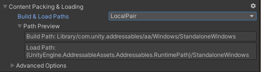
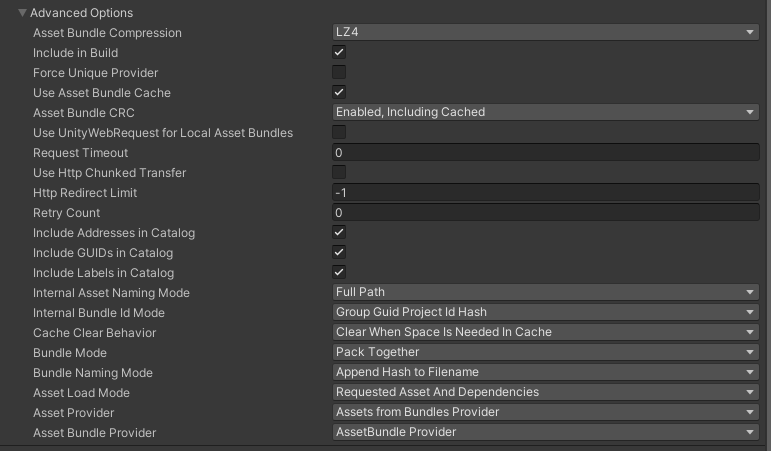

# Group settings

组设置确定如何在内容构建中处理组中的资产。例如，您可以指定 AssetBundles 的构建位置、包压缩设置等。

组的设置在附加到组的[Schema](https://docs.unity3d.com/Packages/com.unity.addressables@1.19/manual/GroupSettings.html#schemas)对象中声明。当您使用**Packed Assets** [template](https://docs.unity3d.com/Packages/com.unity.addressables@1.19/manual/GroupSettings.html#group-templates)创建组时，**Content Packing & Loading**和**Content Update Restriction**架构定义组的设置。默认[Build scripts](https://docs.unity3d.com/Packages/com.unity.addressables@1.19/manual/Builds.html#build-commands)需要这些设置。



*The Inspector window for the Default Local Group*

**NOTE**

*如果您使用**空白**模板创建组，则不会将任何架构附加到该组。默认构建脚本无法处理此类组中的资产。*

## Content Packing & Loading settings

### Build and Load Paths

Content Packing & Loading架构的Build 和Load Paths设置决定了内容构建的工件的创建位置以及可寻址系统在运行时应在何处查找它们。



*Building and loading paths*

| Setting                | Purpose                                                      |
| :--------------------- | :----------------------------------------------------------- |
| **Build & Load Paths** | Profile 路径对定义了 Addressables 构建系统为该组创建工件的位置以及 Addressables 系统在运行时加载这些工件的位置。从列表中选择一个路径对，或者选择`<custom>`是否要分别设置构建和加载路径。 |
| **Build Path**         | 一个 Profile 变量，用于定义 Addressables 构建系统为该组创建工件的位置。您还可以设置自定义字符串。对构建路径使用以下选项之一：<br/>\- **LocalBuildPath**：用于您计划作为应用程序安装的一部分分发的资产。<br/>\- **RemoteBuildPath**：用于您计划使用远程托管服务（例如 Unity Cloud Content Delivery 或其他内容交付网络）分发的资产。<br/>\- **<custom>** : 指定一个字符串作为该组的构建路径。<br/>仅当您将**Build & Load Paths**设置为`<custom>`. |
| **Load Path**          | 一个 Profile 变量，用于定义 Addressables 系统在运行时为该组加载构建工件的位置。您还可以设置自定义字符串。使用以下加载路径之一：<br/>\- **LocalLoadPath**：用于您计划作为应用程序安装的一部分分发的资产。<br/>\- **RemoteLoadPath**：用于您计划使用远程托管服务（例如 Unity Cloud Content Delivery 或其他内容交付网络）分发的资产。<br/>\- **<custom>** : 指定一个字符串作为该组的加载路径。<br/>仅当您将**Build & Load Paths**设置为`<custom>`. |

构建和加载路径选项由[Profiles](https://docs.unity3d.com/Packages/com.unity.addressables@1.19/manual/AddressableAssetsProfiles.html) 中的变量定义。请注意，只有用于给定目的的变量才能用于设置。例如，为构建路径设置选择加载路径变量不会给您带来有用的结果。

当您选择 Profile 变量时，路径的当前评估显示在**Path Preview** 中。大括号中的路径组件，例如`{UnityEngine.AddressableAssets.Addressable.RuntimePath}`，表示静态变量用于在运行时构建最终路径。当可寻址系统在运行时初始化时，路径的那部分被静态变量的当前值替换。

**WARNING**

*在大多数情况下，您不应更改本地构建或加载路径的默认值。如果这样做，在进行 Player 构建之前，您必须将本地构建工件从您的自定义构建位置复制到项目的 [StreamingAssets] 文件夹中。更改这些路径还排除了将您的可寻址对象构建为 Player 构建的一部分。*

有关详细信息，请参阅 [Profiles](https://docs.unity3d.com/Packages/com.unity.addressables@1.19/manual/AddressableAssetsProfiles.html)。

### Advanced Options



*The Advanced Options section*

| Setting                                         | Purpose                                                      |
| :---------------------------------------------- | :----------------------------------------------------------- |
| **Asset Bundle Compression**                    | 从组生成的所有包的压缩类型。LZ4 通常是最有效的选项，但在特定情况下其他选项可能会更好。看[AssetBundle Compression](https://docs.unity3d.com/2019.4/Documentation/Manual/AssetBundles-Cache.html) 想要查询更多的信息。 |
| **Include In Build**                            | 是否在内容构建中包含此组中的资产。                           |
| **Force Unique Provider**                       | Addressables 是否为此组使用资源提供程序类的唯一实例。如果您对该组中的资产类型具有自定义提供程序实现，并且这些提供程序的实例不得在组之间共享，则启用此选项。 |
| **Use Asset Bundle Cache**                      | 是否缓存远程分发的包。                                       |
| **Asset Bundle CRC**                            | 是否在加载之前验证包的完整性。<br /> • **Disabled**: 从不检查捆绑的完整性。<br /> • **Enabled, Including Cached**: 始终检查包完整性。<br /> • **Enabled, Excluding Cached**: 下载时检查包的完整性。 |
| **Use UnityWebRequest for Local Asset Bundles** | 此组加载本地 AssetBundle 档案使用 [UnityWebRequestAssetBundle.GetAssetBundle](https://docs.unity3d.com/2019.4/Documentation/ScriptReference/Networking.UnityWebRequest.GetAssetBundle.html) 代替 [AssetBundle.LoadFromFileAsync](https://docs.unity3d.com/2019.4/Documentation/ScriptReference/AssetBundle.LoadFromFileAsync.html). |
| **Request Timeout**                             | 下载远程包的超时间隔。                                       |
| **Use Http Chunked Transfer**                   | 下载 bundle 时是否使用 HTTP/1.1 分块传输编码方法。<br />在 Unity 2019.3+ 中已弃用并被忽略。 |
| **Http Redirect Limit**                         | 下载包时允许的重定向次数。设置为 -1 表示没有限制。           |
| **Retry Count**                                 | 重试失败下载的次数。                                         |
| **Include Addresses in Catalog**                | 是否在目录中包含地址字符串。如果您不使用地址字符串加载组中的资产，则可以通过不包括它们来减小目录的大小。 |
| **Include GUIDs in Catalog**                    | 是否在目录中包含 GUID 字符串。您必须包含 GUID 字符串才能使用 [AssetReference](https://docs.unity3d.com/Packages/com.unity.addressables@1.19/manual/AssetReferences.html) 访问资源. 如果您不使用 AssetReferences 或 GUID 字符串加载组中的资产，则可以通过不包括它们来减小目录的大小。 |
| **Include Labels in Catalog**                   | 是否在目录中包含标签字符串。如果您不使用标签加载组中的资产，则可以通过不包括它们来减小目录的大小。 |
| **Internal Asset Naming Mode**                  | How to name assets in the catalog internally: <br />- **Full Path**: 项目中的资产完整路径<br /> - **Filename**: 资产的文件名 <br />- **GUID**: 资产 GUID 字符串 <br />- **Dynamic**: Addressables 系统根据资产中的资产选择最小的内部命名团体 |
| **Internal Bundle Id Mode**                     | 确定如何构造 AssetBundle 的内部 Id。例如，当您设置**Group Guid**选项时，Addressables 通过将组名称与捆绑 GUID 字符串组合来创建捆绑 ID。 |
| **Cache Clear Behavior**                        | 确定已安装的应用程序何时从缓存中清除 AssetBundles。          |
| **Bundle Mode**                                 | 如何将此组中的资产打包成包： <br />- **Pack Together**: 创建一个包含所有资产的包。 <br />- **Pack Separately**: 为组中的每个主要资产创建一个包。子资产，例如 Sprite 表中的 Sprite，被打包在一起。添加到组中的文件夹中的资产也打包在一起。<br />- **Pack Together by Label**:为共享相同标签组合的资产创建捆绑包。 |
| **Bundle Naming Mode**                          | 如何构造 AssetBundles 的文件名。                             |
| **Asset Load Mode**                             | 是根据您的请求单独加载资产（默认）还是始终一起加载组中的所有资产。 |
| **Asset Provider**                              | 定义 Addressables 使用哪个 Provider 类从由此组生成的 AssetBundles 加载资产。将此选项设置为**Assets from Bundles Provider，**除非您有自定义 Provider 实现来提供 AssetBundle 中的资产。 |
| **Asset Bundle Provider**                       | 定义 Addressables 使用哪个 Provider 类加载从该组生成的 AssetBundles。将此选项设置为**AssetBundle Provider，**除非您有自定义 Provider 实现来提供 AssetBundle。 |

## Content Update Restriction

Content Update Restriction选项确定 [Check for Content Update Restrictions] 工具如何处理组中的资产。运行此工具为您的组准备差异内容更新构建（而不是完整内容构建）。该工具将设置为**Cannot Change Post Release**任何组中的已修改资产移动到新组。

该***Update Restriction**选项包括：

- **Can Change Post Release**：该工具不会移动任何资产。如果捆绑包中的任何资产发生了变化，则整个捆绑包将被重建。
- **Cannot Change Post Release**：如果捆绑包中的任何资产已更改，则 [Check for Content Update Restrictions] 工具会将它们移动到为更新创建的新组。当您进行更新构建时，从这个新组创建的 AssetBundles 中的资产会覆盖现有包中的版本。

有关更多信息，请参阅 [Content update builds](https://docs.unity3d.com/Packages/com.unity.addressables@1.19/manual/ContentUpdateWorkflow.html) 。

## Group templates

组模板定义为新组创建哪些类型的架构对象。Addressables 系统包括**Packed Assets**模板，其中包括使用默认构建脚本构建和加载 Addressables 所需的所有设置。

如果您创建自己的构建脚本或需要额外设置的实用程序，您可以在您自己的架构对象中定义这些设置并创建您自己的组模板：

1. 使用 Project 面板导航到 Assets 文件夹中的所需位置。
2. 创建一个Blank Group Template（菜单：**Assets > Addressables > Group Templates > Blank Group Templates**）。
3. 为模板指定一个合适的名称。
4. 如果需要，在“检查器”窗口中添加说明。
5. 单击**Add Schema**按钮并从架构列表中进行选择。
6. 继续添加模式，直到所有必需的模式都添加到列表中。

**NOTE**

如果您使用默认构建脚本，则组必须使用**Content Packing & Loading**架构。如果您使用内容更新版本，则组必须包含**Content Update Restrictions**架构。有关更多信息，请参阅[Builds](https://docs.unity3d.com/Packages/com.unity.addressables@1.19/manual/Builds.html)。

## Schemas

组架构是一个 ScriptableObject，它定义了可寻址组的设置集合。您可以为一个组分配任意数量的模式。Addressables 系统为其自身目的定义了许多模式。您还可以创建自定义架构来支持您自己的构建脚本和实用程序。

内置模式包括：

- **Content Packing & Loading**：这是默认构建脚本使用的主要可寻址模式，并定义了构建和加载可寻址资产的设置。
- **Content Update Restrictions**：定义对先前构建进行差异更新的设置。有关更新构建的更多信息，请参阅[Builds](https://docs.unity3d.com/Packages/com.unity.addressables@1.19/manual/Builds.html)。
- **Resources and Built In Scenes**：一种特殊用途的模式，定义了在**Built In Data**组中显示哪些类型的内置资产的设置。

### Defining custom schemas

要创建您自己的架构，请扩展[AddressableAssetGroupSchema](https://docs.unity3d.com/Packages/com.unity.addressables@1.19/api/UnityEditor.AddressableAssets.Settings.AddressableAssetGroupSchema.html)类（它是一种 ScriptableObject）。

```csharp
using UnityEditor.AddressableAssets.Settings;

public class __CustomSchema __: AddressableAssetGroupSchema
{
   public string CustomDescription;
}
```

定义自定义架构对象后，您可以使用这些实体的检查器窗口上的添加架构按钮将其添加到现有组和组模板。

您可能还想创建一个自定义编辑器脚本来帮助用户与您的自定义设置进行交互。请参阅[Custom Inspector scripts](https://docs.unity3d.com/2019.4/Documentation/Manual/VariablesAndTheInspector.html)。

在构建脚本中，您可以使用其[AddressableAssetGroup](https://docs.unity3d.com/Packages/com.unity.addressables@1.19/api/UnityEditor.AddressableAssets.Settings.AddressableAssetGroup.html)对象访问组的架构设置。

