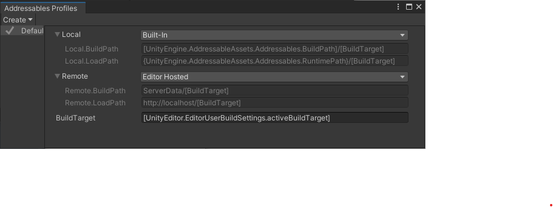
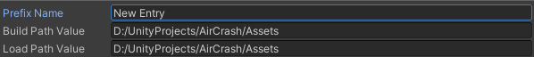
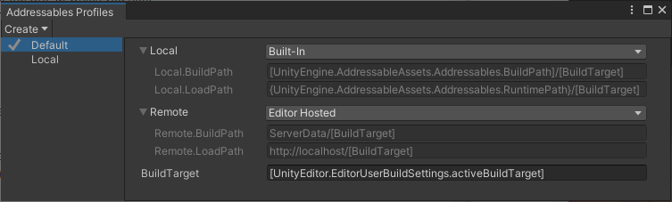
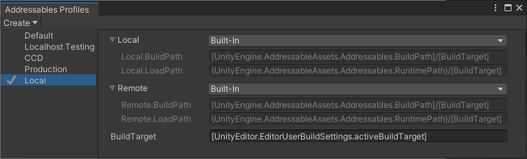
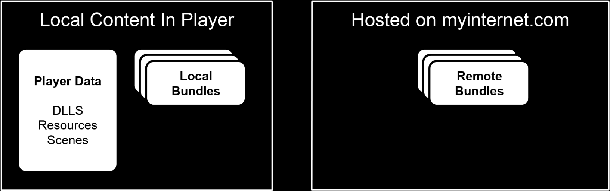
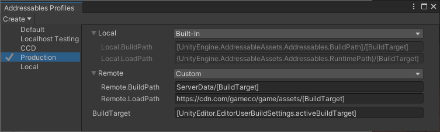

# Profiles

配置文件包含一组可寻址构建脚本使用的变量。这些变量定义了诸如保存构建工件的位置以及运行时加载数据的位置等信息。您可以添加自定义配置文件变量以在您自己的构建脚本中使用。

打开配置文件窗口（菜单：**Window > Asset Management > Addressables > Profiles**）以编辑配置文件值并创建新配置文件。

*The **Addressables Profiles** window showing the default profile.*

您可以为开发过程中的不同阶段或任务设置不同的配置文件。例如，您可以创建一个配置文件以在开发项目时使用，一个用于测试，一个用于最终发布或发布。当您移动到不同的阶段或执行不同的任务时，提前设置配置文件并在它们之间交换比单独编辑值更不容易出错。

右键单击配置文件名称以将其设置为活动配置文件、重命名该配置文件或将其删除。

Addressables 默认定义了五个配置文件变量：

- Local：为本地内容定义两个路径变量：
  - **Local.BuildPath**：在哪里构建包含要与应用程序一起在本地安装的资产的文件。默认情况下，此路径位于您的 Project Library 文件夹中。
  - **Local.LoadPath**：在哪里加载您的应用程序在本地安装的资产。默认情况下，此路径位于 StreamingAssets 文件夹中。当您构建播放器（但不是从其他位置）时，Addressables 会自动包含构建到 StreamingAssets 中默认位置的本地内容。
- Remote：为远程内容定义两个路径变量：
  - **Remote.BuildPath**：在哪里构建包含您计划远程分发的资产的文件。
  - **Remote.LoadPath**：从中下载远程内容和目录的 URL。
- **BuildTarget** : 构建目标的名称，例如 Android 或 StandaloneWindows64

您可以为 **Local** 和 **Remote** 路径变量选择以下预定义的**Bundle Locations**：

- **Built-In**：本地内容的路径定义。构建系统会自动在您的 Player 构建中包含使用此设置构建的内容。您不应更改这些路径值。
- **Editor Hosted**：与编辑器 [Hosting service] 一起使用的路径定义。根据您设置托管服务的方式，您可能需要编辑加载路径以匹配服务 URL。
- ***Cloud Content Delivery**：**Unity Cloud Content Delivery**(CCD) 服务的路径定义。需要在项目设置的 **Services** 部分创建一个 Unity 项目 ID （或链接到现有 ID）。您还必须安装**CCD 管理 SDK**包。有关设置和使用**Cloud Content Delivery** **Bundle Location**选项的信息，请参阅[Addressable Asset system with Cloud Content Delivery](https://docs.unity3d.com/Packages/com.unity.addressables@1.19/manual/AddressablesCCD.html)。
- **Custom**：允许您编辑用于构建和加载路径的值。有关使用 Addressables 在构建时和运行时评估的占位符设置变量值的信息，请参阅[Profile variable syntax](https://docs.unity3d.com/Packages/com.unity.addressables@1.19/manual/AddressableAssetsProfiles.html#profile-variable-syntax)。

**WARNING**

*在大多数情况下，您不应更改本地构建或加载路径的默认值。如果这样做，您必须在进行 Player 构建之前手动将本地构建工件从您的自定义构建位置复制到项目的[StreamingAssets](https://docs.unity3d.com/2019.4/Documentation/Manual/SpecialFolders.html)文件夹。更改这些路径还排除了将您的可寻址对象构建为 Player 构建的一部分。*

有关Addressables 在内容构建期间如何使用配置文件的更多信息，请参阅[Builds](https://docs.unity3d.com/Packages/com.unity.addressables@1.19/manual/Builds.html)。

**TIP**

*当您远程分发应用程序的内容时，使用多个配置文件最有帮助。如果您在应用程序安装过程中分发所有内容，那么单个默认配置文件可能是您唯一需要的配置文件。*

## Setting the active profile

活动配置文件确定运行构建脚本时使用的变量集。

要设置活动配置文件，请执行以下任一操作：

1. 打开 Groups 窗口（菜单：**Window > Asset Management > Addressables > Groups**）。
2. 单击工具栏中的 **Profile** 菜单。
3. 选择要激活的配置文件。

或者：

1. 打开 Profiles 窗口（菜单：**Window > Asset Management > Addressables > Profiles**）。
2. Right- or cmd-click配置文件以打开上下文菜单。
3. 选择**Set Active**。

**NOTE**

构建脚本包括在编辑器中进入播放模式时 Addressables 调用的[Play Mode Scripts](https://docs.unity3d.com/Packages/com.unity.addressables@1.19/manual/Groups.html#play-mode-scripts)。某些播放模式脚本使用活动配置文件中的变量来定位内容。有关更多信息，请参阅[Play Mode Scripts](https://docs.unity3d.com/Packages/com.unity.addressables@1.19/manual/Groups.html#play-mode-scripts)。

## Adding a new profile

要创建新配置文件，请选择**Create** > **Profile**。表中出现一个新的配置文件行。

每个配置文件都必须为每个变量定义一个值。创建新配置文件时，Addressables 会复制当前选定配置文件中的所有值。

## Adding a new variable

您可以将两种变量添加到您的配置文件中：

- 基本变量定义单个值
- 一个路径对定义了一组两个路径值；一种用于构建路径，一种用于加载路径

您可以使用基本变量作为路径值的组成部分（**BuildTarget**就是一个示例），并且您可以在自己的构建脚本中使用它们。使用路径对变量来设置Addressables [Groups] 和[remote catalog](https://docs.unity3d.com/Packages/com.unity.addressables@1.19/manual/AddressableAssetSettings.html#content-update)的**Build & Local Paths**设置。

要添加新的配置文件变量，请从 **Create** 菜单中选择 **Variable** 或**Build & Local Paths** 。在出现提示时，为新变量指定名称和值，然后单击**Save**。Addressables 将新变量添加到所有配置文件。

右键单击变量名称以重命名或删除变量。

### Path Pairs

路径对定义了一组匹配的`BuildPath`和`LoadPath`变量。创建路径对时，您可以使用该对名称将 [Addressable Group](https://docs.unity3d.com/Packages/com.unity.addressables@1.19/manual/Groups.html)或远程目录的 [path setting](https://docs.unity3d.com/Packages/com.unity.addressables@1.19/manual/GroupSettings.html#build-and-load-paths) 分配为一个单元。

要创建路径对，请选择**Create** > **Build Load Path Variables**。在提示符下，为路径对指定前缀名称并将路径字符串分配给各个字段。

*A new path pair*

新路径对使用带有初始值的**Custom** **Bundle Location**设置。如果需要，您可以更改为不同的**Bundle Location**。

**TIP**

*您可以通过在“配置文件”窗口中重命名构建和加载路径的两个常规变量，将它们“转换”为路径对。将一个设置为`VariableName.BuildPath`，另一个设置为`VariableName.LoadPath`。*

*The **Addressables Profiles** window showing two profiles with two path pairs.*

### Default path values

构建和加载路径的默认值为：

- 本地构建路径： `[UnityEditor.EditorUserBuildSettings.activeBuildTarget]`
- 本地加载路径： `[UnityEngine.AddressableAssets.Addressables.BuildPath]/[BuildTarget]`
- 远程构建路径： `ServerData/[BuildTarget]`
- 远程加载路径： `http://localhost/[BuildTarget]`

在大多数情况下，您不应更改本地路径值。Unity 构建系统期望 AssetBundles 和其他文件存在于默认位置。如果更改本地路径，则必须在构建播放器之前将文件从构建路径复制到加载路径。加载路径必须始终位于 Unity StreamingAssets 文件夹中。

如果远程分发内容，则必须修改远程加载路径以反映托管远程内容的 URL。您可以将远程构建路径设置为任何方便的位置；构建系统不依赖于默认值。

## Profile variable syntax

所有变量都是“字符串”类型。您可以输入固定路径或值。您还可以使用两个语法指示符从静态属性或其他变量派生变量的全部或部分值：

- **Square brackets [ ]**：Addressables 在构建时评估方括号包围的条目。这些条目可以是其他配置文件变量（例如 [BuildTarget]）或代码变量（例如[UnityEditor.EditorUserBuildSettings.activeBuildTarget](https://docs.unity3d.com/2019.4/Documentation/ScriptReference/EditorUserBuildSettings-activeBuildTarget.html)）。在构建期间，当它处理您的组时，Addressables 评估方括号内的字符串并将结果写入目录。
- **Curly brackets { }**：Addressables 在运行时评估被大括号包围的条目。您可以使用运行时类的代码变量（例如 {UnityEngine.AddressableAssets.Addressables.RuntimePath}）。

您可以在方括号和大括号内使用静态字段和属性。名称必须是完全限定的，并且类型必须在上下文中有效。例如，UnityEditor 命名空间中的类不能在运行时使用。

默认 Profile 变量设置中使用的代码变量包括：

- [UnityEditor.EditorUserBuildSettings.activeBuildTarget](https://docs.unity3d.com/2019.4/Documentation/ScriptReference/EditorUserBuildSettings-activeBuildTarget.html)
- [UnityEngine.AddressableAssets.Addressables.BuildPath](https://docs.unity3d.com/Packages/com.unity.addressables@1.19/api/UnityEngine.AddressableAssets.Addressables.BuildPath.html#UnityEngine_AddressableAssets_Addressables_BuildPath)
- [UnityEngine.AddressableAssets.Addressables.RuntimePath](https://docs.unity3d.com/Packages/com.unity.addressables@1.19/api/UnityEngine.AddressableAssets.Addressables.RuntimePath.html#UnityEngine_AddressableAssets_Addressables_RuntimePath)

例如，假设您有一个加载路径：`{MyNamespace.MyClass.MyURL}/content/[BuildTarget]`在创建名为“trees.bundle”的 AssetBundle 的组上设置。在构建期间，目录将该包的加载路径注册为`{MyNamespace.MyClass.MyURL}/content/Android/trees.bundle`，评估`[BuildTarget]`为“Android”并将 AssetBundle 名称添加到路径中。在运行时，在处理目录时，Addressables 系统会评估`{MyNamespace.MyClass.MyURL}`以生成最终加载路径`http://myinternet.com/content/Android/trees.bundle`.

**NOTE**

*在配置文件字符串中引用运行时变量不会阻止 Unity 在其构建优化阶段从应用程序的运行时库中剥离该变量（如果您的代码中没有其他内容引用相同的变量）。有关如何防止类或成员被剥离的更多信息，请参阅[Managed code stripping](https://docs.unity3d.com/2019.4/Documentation/Manual/ManagedCodeStripping.html)剥离。*

## Specifying packing and loading paths

在配置文件中设置必要的变量后，您可以根据这些指定的变量为资产组选择构建和加载路径。

设置构建和加载路径：

1. 从**Project** 窗口中选择一个可寻址资产组。
2. 在组的**Inspector** 中，在**Content Packing & Loading** > **Build and Load Paths 下**，选择所需的路径对。如果选择该`<custom>`选项，则可以分别指定构建和加载路径。

请注意，您没有直接输入路径，而是选择一个变量来表示之前在**Profiles**窗口中定义的路径。该**Path Preview** 根据当前Profile显示当前路径。在Group设置Inspector中直接修改路径，设置**Build & Load Paths**成`<custom>`并设置单独的 **Build** 或**Load Path**成`<custom>`。编辑的路径仅适用于该组。

## Profile examples

考虑以下示例，演示内容的本地开发阶段。

*Content with local and remote bundles stored locally for development.*

在开发过程中，您将使用本地路径同时拥有本地和远程包，如下所示。

*Paths set for local development.*

在这个例子中，你可以看到本地和远程路径实际上是本地的，这样就没有必要为了本地开发而设置远程服务器。

一旦内容准备好用于生产，您就可以将远程包移动到服务器，如下图所示。

*Content with the remote bundles moved to a server for production.*

在这种情况下，使用配置文件，您可以将“Production”的远程加载路径更改为该服务器。无需更改您的资产组，您可以将所有远程捆绑包更改为实际远程。

*Paths set for hosting remote content*

**IMPORTANT**

- Addressables 系统仅在 Player 构建期间将数据从[Addressables.BuildPath](https://docs.unity3d.com/Packages/com.unity.addressables@1.19/api/UnityEngine.AddressableAssets.Addressables.BuildPath.html#UnityEngine_AddressableAssets_Addressables_BuildPath)复制到 StreamingAssets 文件夹——**它不处理通过 LocalBuildPath 或 LocalLoadPath 变量指定的任意路径**。如果将数据构建到不同位置或从不同于默认位置的位置加载数据，则必须手动复制数据。
- 同样，您必须手动将远程 AssetBundle 和关联的目录和哈希文件上传到您的服务器，以便可以通过**RemoteLoadPath**定义的 URL 访问它们。