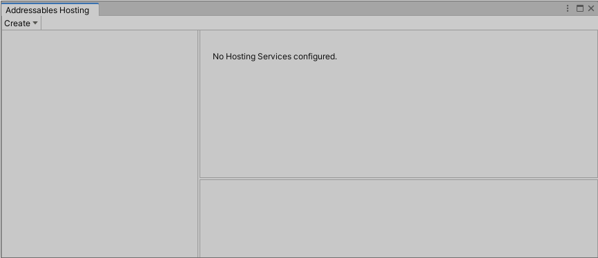
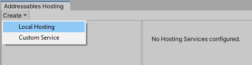
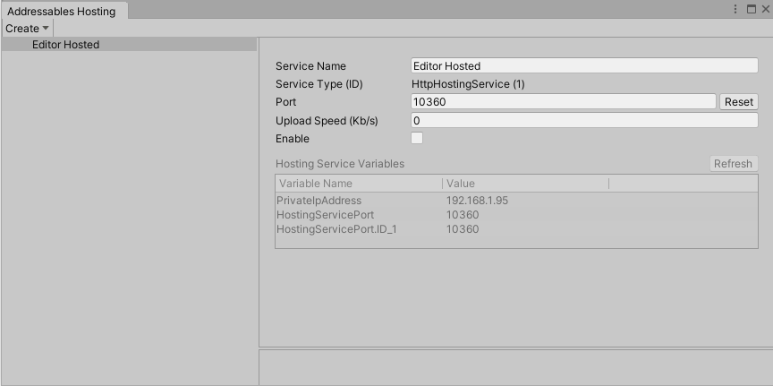
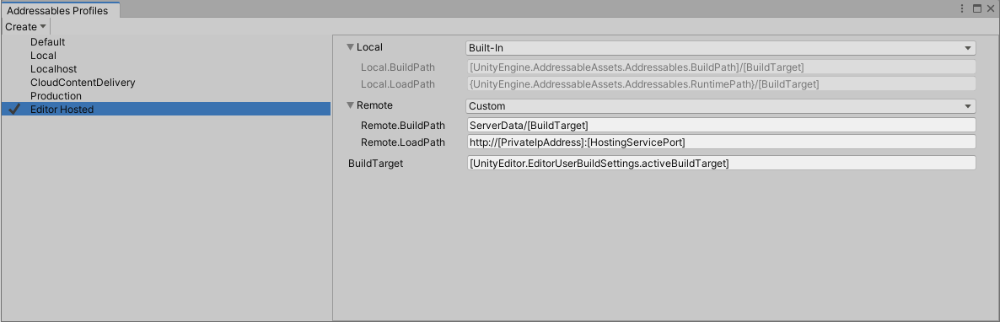
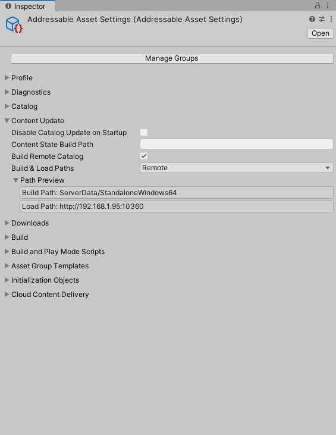
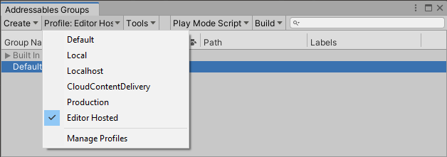
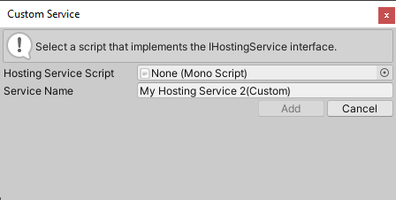

# Asset Hosting Services

## Overview

Hosting Services 提供了一个集成工具，用于使用可寻址资产配置数据从 Unity 编辑器内向本地或网络连接的应用程序构建提供打包内容。Hosting Services可以在测试打包内容时提高迭代速度，还可以向本地和远程网络上的连接客户端提供内容。

### Packed mode testing and iteration

从编辑器播放模式测试转移到平台应用程序构建测试会给开发过程带来复杂性和时间成本。托管服务提供可扩展的嵌入编辑器的内容交付服务，这些服务直接映射到您的 Addressables 组配置。使用自定义 Addressables 配置文件，您可以配置应用程序以从 Unity 编辑器本身加载所有内容。这包括部署到移动设备或任何其他平台的构建，这些平台可以通过网络访问您的开发系统。

## Setup

本文详细介绍了您的项目的资产托管服务的初始设置。虽然设置指南侧重于编辑器工作流，但您可以使用 API 通过设置[AddressableAssetSettings](https://docs.unity3d.com/Packages/com.unity.addressables@1.19/api/UnityEditor.AddressableAssets.Settings.AddressableAssetSettings.html)类的[HostingServicesManager](https://docs.unity3d.com/Packages/com.unity.addressables@1.19/api/UnityEditor.AddressableAssets.HostingServices.HostingServicesManager.html)属性来配置托管服务。

### Configuring a new Hosting Service

使用**Hosting window**添加、配置和启用新的托管服务。在编辑器中，选择**Window** > **Asset Management** > **Addressables** > **Hosting**，或从**Addressables Groups**窗口菜单中单击**Tools** > **Window** > **Hosting Services**按钮以访问**Addressables Hosting**窗口。

### Configuring a new Hosting Service

使用**托管窗口**添加、配置和启用新的托管服务。在编辑器中，选择**Window** > **Asset Management** > **Addressables** > **Hosting**，或从**Addressables Groups**窗口菜单中单击**Tools** > **Window** > **Hosting Services**按钮以访问**Addressables Hosting**窗口。



*The **Addressables Hosting** window.*

要添加新的本地托管服务，请单击**Create** > **Local Hosting**按钮。



*Adding a new Hosting Service.*

**Note**：有关实现自定义托管服务类型的更多信息，请参阅[自定义服务](https://docs.unity3d.com/Packages/com.unity.addressables@1.19/manual/AddressableAssetsHostingServices.html#custom-services)部分。

新添加的服务出现在**Addressables Hosting**窗口的**Hosting Services**部分。使用**Service Name**字段输入服务的名称。

新服务默认为禁用状态。要启动该服务，请选中 **Enable** 复选框。



*The updated **Addressables Hosting** window after adding a service.*

HTTP Hosting Service 在启动时会自动分配一个端口号。该服务保存端口号并在 Unity 会话之间重用它。要选择不同的端口，请在 **Port** 字段中分配特定端口号，或单击 **Reset** 按钮分配不同的随机端口号。

**WARNING**

*如果重置端口号，则必须执行完整的应用程序构建以生成并嵌入正确的 URL。*

HTTP 托管服务现已启用并准备好从每个资产组的远程[BuildPath](https://docs.unity3d.com/Packages/com.unity.addressables@1.19/api/UnityEditor.AddressableAssets.Settings.GroupSchemas.BundledAssetGroupSchema.BuildPath.html#UnityEditor_AddressableAssets_Settings_GroupSchemas_BundledAssetGroupSchema_BuildPath)中指定的目录提供内容。

### Hosting Service profile setup

在开发期间使用托管服务时，请考虑创建一个配置文件，将资产组配置为从托管服务加载。有关配置文件的更多信息，请参阅 [Addressable Assets Profiles](https://docs.unity3d.com/Packages/com.unity.addressables@1.19/manual/AddressableAssetsProfiles.html)。

进入**Addressables Profiles**窗口后，通过**Create** > **Profile**创建一个新的配置文件。在以下示例中，新配置文件称为“Editor Hosted”。

修改远程加载 URL 以从托管服务加载。在**Addressables Hosting**窗口中，您可以使用远程**LoadPath**变量中名为`[PrivateIpAddress]`和`[HostingServicePort]`的字段来构建路径 URL（例如，）。`http://[PrivateIpAddress]:[HostingServicePort]`



*Configuring the service's profile.*

验证是否正确配置了每个组。确保将[BuildPath](https://docs.unity3d.com/Packages/com.unity.addressables@1.19/api/UnityEditor.AddressableAssets.Settings.GroupSchemas.BundledAssetGroupSchema.BuildPath.html#UnityEditor_AddressableAssets_Settings_GroupSchemas_BundledAssetGroupSchema_BuildPath)和[LoadPath](https://docs.unity3d.com/Packages/com.unity.addressables@1.19/api/UnityEditor.AddressableAssets.Settings.GroupSchemas.BundledAssetGroupSchema.LoadPath.html#UnityEditor_AddressableAssets_Settings_GroupSchemas_BundledAssetGroupSchema_LoadPath)路径设置为您修改后用于托管服务的各自配置文件键。在此示例中，您可以看到应如何扩展[LoadPath ](https://docs.unity3d.com/Packages/com.unity.addressables@1.19/api/UnityEditor.AddressableAssets.Settings.GroupSchemas.BundledAssetGroupSchema.LoadPath.html#UnityEditor_AddressableAssets_Settings_GroupSchemas_BundledAssetGroupSchema_LoadPath)中的配置文件变量以构建正确的基本 URL，以便从托管服务加载资产。



*Inspecting the service's load paths.*

**TIP**

*使用**Path Preview**来验证配置文件变量是否解析为正确的变量。加载路径 URL IP 地址和端口必须与**Addressables Hosting**窗口中显示的服务匹配。*

最后，从**Addressables Groups**窗口中选择新配置文件，创建构建，然后部署到目标设备。Unity Editor 现在通过[HttpHostingService](https://docs.unity3d.com/Packages/com.unity.addressables@1.19/api/UnityEditor.AddressableAssets.HostingServices.HttpHostingService.html)服务处理来自应用程序的所有加载请求。您现在无需重新部署即可添加和更改内容。重新构建可寻址内容，并重新启动已部署的应用程序以刷新内容。



*Selecting a Hosting Service profile.*

### Batch mode

您还可以使用托管服务从以批处理模式运行的 Unity 编辑器提供内容。为此，请使用以下选项从命令行启动 Unity：

```
-batchMode -executeMethod UnityEditor.AddressableAssets.HostingServicesManager.BatchMode
```

这将从默认的[AddressableAssetSettings](https://docs.unity3d.com/Packages/com.unity.addressables@1.19/api/UnityEditor.AddressableAssets.Settings.AddressableAssetSettings.html)对象加载托管服务配置，并启动所有配置的服务。

要使用替代的[AddressableAssetSettings](https://docs.unity3d.com/Packages/com.unity.addressables@1.19/api/UnityEditor.AddressableAssets.Settings.AddressableAssetSettings.html)配置，请创建您自己的静态方法入口点，以通过[HostingServicesManager.BatchMode(AddressableAssetSettings settings)](https://docs.unity3d.com/Packages/com.unity.addressables@1.19/api/UnityEditor.AddressableAssets.HostingServices.HostingServicesManager.BatchMode.html#UnityEditor_AddressableAssets_HostingServices_HostingServicesManager_BatchMode_UnityEditor_AddressableAssets_Settings_AddressableAssetSettings_)重载进行调用。

## Custom services

您可以创建自定义服务来实现您自己的逻辑，以便为来自可寻址资产系统的内容加载请求提供服务。例如：

- 支持使用非 HTTP 协议下载内容的自定义[IResourceProvider](https://docs.unity3d.com/Packages/com.unity.addressables@1.19/api/UnityEngine.ResourceManagement.ResourceProviders.IResourceProvider.html)。
- 管理用于提供与您的生产 CDN 解决方案（例如 Apache HTTP 服务器）相匹配的内容的外部流程。

### Implementing a custom service

该[HostingServicesManager](https://docs.unity3d.com/Packages/com.unity.addressables@1.19/api/UnityEditor.AddressableAssets.HostingServices.HostingServicesManager.html)可以管理任何类，它实现的[IHostingService](https://docs.unity3d.com/Packages/com.unity.addressables@1.19/api/UnityEditor.AddressableAssets.HostingServices.IHostingService.html)接口（用于方法参数和返回值的更多详细信息，请参阅[API文档](https://docs.unity3d.com/Packages/com.unity.addressables@1.19/api/UnityEditor.AddressableAssets.HostingServices.IHostingService.html)。

要创建新的自定义服务：

1. 按照上面[配置新托管服务](https://docs.unity3d.com/Packages/com.unity.addressables@1.19/manual/AddressableAssetsHostingServices.html#configuring-a-new-hosting-service)部分中概述的步骤进行操作，但不要选择**Create** > **Local Hosting**按钮，而是选择**Create** > **Custom Service**按钮。
2. 将适用的脚本拖到其字段中，或从对象选择器中选择它。该对话框会验证所选脚本是否实现了[IHostingService](https://docs.unity3d.com/Packages/com.unity.addressables@1.19/api/UnityEditor.AddressableAssets.HostingServices.IHostingService.html)接口。
3. 要完成添加服务，请单击**Add** 按钮。

展望未来，您的自定义服务将出现在 **Service Type** 下拉选项中。



*Adding a custom Asset Hosting Service.*
