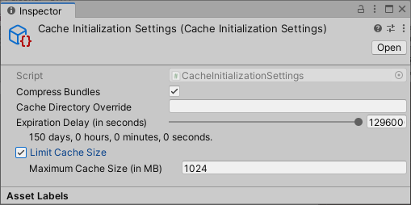

# Customizing Addressables initialization

Addressables 系统在您第一次加载 Addressable 或再次调用 Addressable API 时在运行时初始化自身。调用[Addressables.InitializeAsync](https://docs.unity3d.com/Packages/com.unity.addressables@1.19/api/UnityEngine.AddressableAssets.Addressables.InitializeAsync.html)以提前初始化 Addressables（如果初始化已经发生，此函数不执行任何操作）。

初始化操作执行以下任务：

- 设置[ResourceManager](https://docs.unity3d.com/Packages/com.unity.addressables@1.19/api/UnityEngine.ResourceManagement.ResourceManager.html)和[ResourceLocators](https://docs.unity3d.com/Packages/com.unity.addressables@1.19/api/UnityEngine.AddressableAssets.ResourceLocators.html)。
- 从 StreamingAssets 加载由 Addressables 创建的配置数据。
- 执行任何 [initialization object](https://docs.unity3d.com/Packages/com.unity.addressables@1.19/manual/AddressableAssetSettings.html#initialization-object-list)操作。
- 加载内容目录。默认情况下，Addressables 首先检查内容目录的更新，并在可用时下载新目录。

以下可寻址设置可以更改初始化行为：

- [Disable Catalog Update on Startup](https://docs.unity3d.com/Packages/com.unity.addressables@1.19/manual/AddressableAssetSettings.html#catalog)：Addressables 不会自动检查更新的目录。有关手动更新目录的信息，请参阅[Updating catalogs](https://docs.unity3d.com/Packages/com.unity.addressables@1.19/manual/LoadContentCatalogAsync.html#updating-catalogs)。
- [Build Remote Catalog](https://docs.unity3d.com/Packages/com.unity.addressables@1.19/manual/AddressableAssetSettings.html#catalog)：Addressables 不会尝试在没有远程目录的情况下加载远程内容。
- [Custom certificate handler](https://docs.unity3d.com/Packages/com.unity.addressables@1.19/manual/AddressableAssetSettings.html#downloads)：如果您需要一个自定义证书处理程序来访问您的远程资产托管服务，请确定一个自定义证书处理程序。
- [Initialization object list](https://docs.unity3d.com/Packages/com.unity.addressables@1.19/manual/AddressableAssetSettings.html#initialization-object-list)：将[IObjectInitializationDataProvider](https://docs.unity3d.com/Packages/com.unity.addressables@1.19/api/UnityEngine.ResourceManagement.Util.IObjectInitializationDataProvider.html) ScriptableObjects添加到在初始化操作期间调用的应用程序。

在初始化操作开始之前，应设置以下运行时属性：

- [Custom URL transform function](https://docs.unity3d.com/Packages/com.unity.addressables@1.19/manual/TransformInternalId.html)
- [ResourceManager exception handler](https://docs.unity3d.com/Packages/com.unity.addressables@1.19/api/UnityEngine.ResourceManagement.ResourceManager.ExceptionHandler.html#UnityEngine_ResourceManagement_ResourceManager_ExceptionHandler)
- [Profile variables](https://docs.unity3d.com/Packages/com.unity.addressables@1.19/manual/AddressableAssetsProfiles.html#profile-variable-syntax)中任何自定义运行时占位符的静态属性

### Initialization objects

您可以将对象附加到可寻址资产设置并在运行时将它们传递给初始化过程。例如，您可以创建一个[CacheInitializationSettings](https://docs.unity3d.com/Packages/com.unity.addressables@1.19/api/UnityEditor.AddressableAssets.Settings.CacheInitializationSettings.html)对象来在运行时初始化 Unity 的[缓存](https://docs.unity3d.com/2019.4/Documentation/ScriptReference/Cache.html)设置。要创建您自己的初始化对象类型，请创建一个实现[IObjectInitializationDataProvider](https://docs.unity3d.com/Packages/com.unity.addressables@1.19/api/UnityEngine.ResourceManagement.Util.IObjectInitializationDataProvider.html)接口的 ScriptableObject 。使用此对象来创建Addressables 包含在您的运行时数据中的[ObjectInitializationData](https://docs.unity3d.com/Packages/com.unity.addressables@1.19/api/UnityEngine.ResourceManagement.Util.ObjectInitializationData.html)资产。

### Cache initialization objects

使用[CacheInitializationSettings](https://docs.unity3d.com/Packages/com.unity.addressables@1.19/api/UnityEditor.AddressableAssets.Settings.CacheInitializationSettings.html)对象在运行时初始化 Unity 的[缓存](https://docs.unity3d.com/2019.4/Documentation/ScriptReference/Cache.html)设置。

要指定可寻址系统应使用的缓存初始化设置：

1. 创建 CacheInitializationSettings 资产（菜单：**Assets > Addressables > Initialization > Cache Initialization Settings**）。
2. 在 Project 面板中选择新的资产文件以查看 Inspector 中的设置 
3. 根据需要调整设置。
4. 打开可寻址设置检查器（菜单：**Window > Asset Management > Addressables > Settings**）。
5. 在Inspector的**Initialization Objects**部分中，单击**+**按钮将新对象添加到列表中。
6. 在“文件”对话框中选择您的 CacheInitializationSettings 资产，然后单击“**打开”**。
7. 缓存设置对象被添加到列表中。 

当 Addressables 在运行时初始化时，它会将这些设置应用于默认的 Unity [Cache](https://docs.unity3d.com/2019.4/Documentation/ScriptReference/Cache.html)。这些设置适用于默认缓存中的所有 AssetBundle，而不仅仅是 Addressables 系统下载的那些。有关Unity 缓存系统的更多信息，请参阅[缓存](https://docs.unity3d.com/2019.4/Documentation/ScriptReference/Caching.html)。