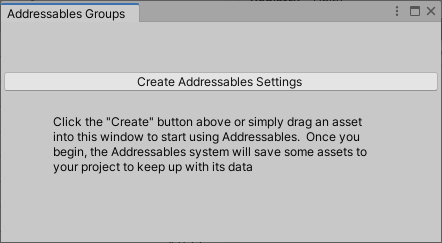

# Configuring Addressables

以下主题概述了用于在项目中设置可寻址系统的配置选项以及指向更详细信息的链接：

- [Initialization](https://docs.unity3d.com/Packages/com.unity.addressables@1.19/manual/Configuration.html#initialization)
- [System settings](https://docs.unity3d.com/Packages/com.unity.addressables@1.19/manual/Configuration.html#system-settings)
- [Group settings](https://docs.unity3d.com/Packages/com.unity.addressables@1.19/manual/Configuration.html#group-settings)
- [Profiles](https://docs.unity3d.com/Packages/com.unity.addressables@1.19/manual/Configuration.html#profiles)
- [Asset hosting service](https://docs.unity3d.com/Packages/com.unity.addressables@1.19/manual/Configuration.html#asset-hosting-service)
- [Preferences](https://docs.unity3d.com/Packages/com.unity.addressables@1.19/manual/Configuration.html#unity-preferences)
- [Additional topics](https://docs.unity3d.com/Packages/com.unity.addressables@1.19/manual/Configuration.html#additional-topics)

## Initialization

Addressables 系统使用一组[ScriptableObject](https://docs.unity3d.com/2019.4/Documentation/ScriptReference/ScriptableObject.html)资产来存储您的配置设置。系统将这些设置资产存储在`Assets/AddressableAssetsData`Unity 项目的文件夹中。当您从 Groups 窗口初始化 Addressables 时，它会创建此文件夹和默认设置对象。安装 Addressables 包后打开[Groups window](https://docs.unity3d.com/Packages/com.unity.addressables@1.19/manual/Groups.html#groups-window)（菜单： **Window > Asset Management > Addressables > Groups**）。

第一次打开 [Groups window](https://docs.unity3d.com/Packages/com.unity.addressables@1.19/manual/Groups.html#groups-window)，单击**Create Addressables Settings**运行初始化命令以创建设置文件夹和资产：

*Before initializing the Addressables system in a Project*

将`AddressableAssetsData`文件夹及其内容添加到您的源代码管理系统。

有关使用可寻址系统的快速指南和[Managing Addressables in the Editor](https://docs.unity3d.com/Packages/com.unity.addressables@1.19/manual/AddressableAssetsDevelopmentCycle.html)请参阅 [Getting started](https://docs.unity3d.com/Packages/com.unity.addressables@1.19/manual/AddressableAssetsGettingStarted.html) 以获取有关组织可寻址资产的方法的信息。

## System settings

AddressableAssetsSettings 对象包含项目的全局系统设置。您可以从菜单访问这些设置：**Window > Asset Management > Addressables > Settings**或从 [Groups window](https://docs.unity3d.com/Packages/com.unity.addressables@1.19/manual/Groups.html#groups-window)上的 **Tools** 菜单。

有关每个设置的信息，请参阅[Addressable system settings](https://docs.unity3d.com/Packages/com.unity.addressables@1.19/manual/AddressableAssetSettings.html)。

## Group settings

Addressables 系统使用您定义的[Groups](https://docs.unity3d.com/Packages/com.unity.addressables@1.19/manual/Groups.html)来确定如何将您的 Addressable 资产打包到本地和远程 AssetBundle 中。每个组都有自己的设置对象，您可以使用它来控制该组的选项。每当您创建组时，Addressables 都会创建一个新的设置对象。

有关详细信息，请参阅 [Groups](https://docs.unity3d.com/Packages/com.unity.addressables@1.19/manual/Groups.html)和[Group settings](https://docs.unity3d.com/Packages/com.unity.addressables@1.19/manual/GroupSettings.html)。

## Profiles

[Profiles](https://docs.unity3d.com/Packages/com.unity.addressables@1.19/manual/AddressableAssetsProfiles.html)允许您根据构建目的配置构建变量集。例如，您可以配置一个配置文件以用于项目的开发构建，一个用于测试构建，另一个用于发布发布构建。您可以根据需要创建任意数量的配置文件。

有关详细信息，请参阅[Profiles](https://docs.unity3d.com/Packages/com.unity.addressables@1.19/manual/AddressableAssetsProfiles.html)。

## Asset hosting service

Addressables 系统提供在 Unity 编辑器中运行的资产托管服务。您可以使用此服务通过 HTTP 连接测试您的远程内容。

有关更多信息，请参阅 [Asset hosting service](https://docs.unity3d.com/Packages/com.unity.addressables@1.19/manual/AddressableAssetsHostingServices.html)。

## Unity Preferences

Addressables 包将其自己的部分添加到 Unity Editor [Preferences](https://docs.unity3d.com/2019.4/Documentation/Manual/Preferences.html)窗口。Addressables 首选项包括：

**Debug Build Layout**

启用后，构建系统会生成[Build layout report](https://docs.unity3d.com/Packages/com.unity.addressables@1.19/manual/BuildLayoutReport.html)。默认情况下禁用此选项，因为它增加了创建构建所需的时间。构建报告包含构建生成的每个 AssetBundle 的详细描述。

有关此分析工具和其他分析工具的说明，请参阅 [Diagnostic tools](https://docs.unity3d.com/Packages/com.unity.addressables@1.19/manual/DiagnosticTools.html)。

**Build Addressables on Player Build** (Unity 2021.2+)

确定 Unity 是否将 Addressables 内容构建为 Player 构建的一部分。

与播放器一起构建可寻址内容可能很方便，但确实会增加构建时间，尤其是在大型项目中，因为即使您没有修改任何资产，这也会重建可寻址内容。如果您不在大多数构建之间更改 Addressables 内容，请考虑禁用此选项。

选项包括：

- **Build Addressables content on Player Build**：构建播放器时始终构建可寻址内容。
- **Do not Build Addressables content on Player Build**：构建播放器时切勿构建可寻址内容。（如果修改 Addressables 内容，则必须在构建播放器之前手动重建它。）
- **Use global Settings (stored in preferences)**：使用 Unity 编辑器首选项中指定的值（在**Addressables**下）。此选项允许每个项目贡献者根据自己的选择设置选项。

前两个选项覆盖当前项目的全局首选项并影响构建项目的所有贡献者。否则，全局首选项适用于所有 Unity 项目。

有关更多信息，请参阅 [Building Addressables content with Player builds](https://docs.unity3d.com/Packages/com.unity.addressables@1.19/manual/Builds.html#build-with-player) 。

## Additional topics

有关更多涉及的设置选项，请参阅以下主题：

- [Continuous integration](https://docs.unity3d.com/Packages/com.unity.addressables@1.19/manual/ContinuousIntegration.html)
- [Build scripting](https://docs.unity3d.com/Packages/com.unity.addressables@1.19/manual/BuildPlayerContent.html)
- [Customizing Addressables runtime initialization](https://docs.unity3d.com/Packages/com.unity.addressables@1.19/manual/InitializeAsync.html)
