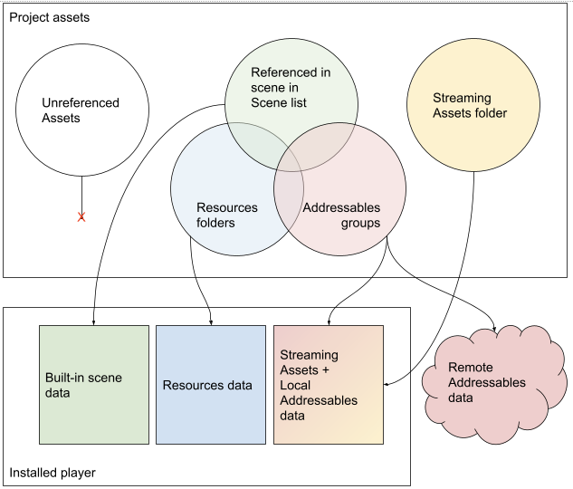
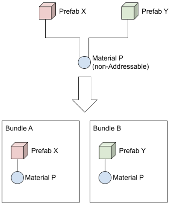

# How Addressables interact with other project assets

当您在 Project Build Settings 中包含场景并构建播放器时，Unity 会在游戏或应用程序的内置数据中包含该场景以及场景中使用的任何资产。同样，Unity 将项目资源文件夹中的任何资产包含在单独的内置资产集合中。（不同之处在于场景中的资产仅作为场景的一部分加载，而 Resources 中的资产可以独立加载。）

可寻址资产既可以作为一组额外的“本地”资产构建到您的游戏或应用程序中，也可以作为托管在服务器上的“远程”资产保留在游戏构建的外部，并在需要时下载。您可以独立于应用程序本身更新远程资产（尽管远程资产不能包含代码，因此您只能更改资产和序列化数据）。

*How project assets are exported to a player build*

但是，如果您在多个类别中使用相同的资产，那么 Unity 在构建时会制作资产的副本，而不是共享单个实例。例如，如果您在内置场景中使用了一个材质，并且也在位于 Resources 文件夹中的预制件中使用了它，那么您最终会在构建中拥有该材质的两个副本——即使材质资产本身不是位于 Resources。如果您随后将同一材料标记为可寻址，则最终会得到三份副本。（项目 StreamingAssets 文件夹中的文件永远不能被该文件夹外的资产引用。）

**NOTE**

*在构建播放器之前，您必须对可寻址资产进行内容构建。在播放器构建期间，Unity 将您的本地 Addressables 复制到 StreamingAssets 文件夹，以便它们与您放置在 StreamingAssets 中的任何资产一起包含在构建中。（这些资产在构建过程结束时被删除。）您有责任将内容构建生成的远程 Addressables 文件上传到您的托管服务。有关更多信息，请参阅[Builds](https://docs.unity3d.com/Packages/com.unity.addressables@1.19/manual/Builds.html)。*

当您在项目中使用 Addressables 时，Unity 建议您将 Resources 文件夹中的场景和任何数据移动到 Addressable 组中，并将它们作为 Addressables 进行管理。

Build Settings 场景列表必须至少包含一个场景。您可以创建一个用于初始化应用程序或游戏的最小场景。

Resources 文件夹中的少量数据通常不会导致性能问题。如果您使用将资产放置在那里的 3rd 包，则无需移动它们，除非它们引起问题。（可寻址资产不能存储在资源文件夹中。）

## Shared assets in groups

当您将资产添加到 Addressables 组时，该资产会在您进行内容构建时打包到 AssetBundle 中。如果资产引用其他资产（称为依赖项），则如何处理这些依赖项取决于它们是否也是可寻址的。可寻址的依赖项根据它们所在组的设置打包到 AssetBundle 中——这可能是与引用资产相同的包或不同的包。不可寻址的依赖项包含在其引用资产的包中。

如果多个 Addressable 引用相同的非 Addressable 资产，则非 Addressable 资产的副本包含在每个包含引用

*Non-Addressable assets are copied to each bundle with a referencing Addressable*

当一项资产隐式包含在多个捆绑包中时，可能会发生一个微妙的后果，即可以在运行时实例化该资产的多个实例，而不是您的游戏逻辑所期望的单个实例。如果您在运行时更改实例状态，则只有来自同一包的对象才能看到更改，因为所有其他资产现在都有自己的单独实例，而不是共享公共实例。

为了消除这种重复，您可以将依赖项设为可寻址资产并将其包含在现有包之一中或将其添加到不同的包中。一旦您使依赖项成为可寻址的，每当您加载引用它的可寻址对象之一时，就会加载它所属的包。

请注意，当您引用另一个包中的资产时，必须在加载当前包中的任何资产时加载该包，而不仅仅是包含引用的资产。尽管没有加载其他 AssetBundle 中的任何资产，但加载包有其自身的运行时成本。有关更多信息，请参阅 [Asset bundle dependencies](https://docs.unity3d.com/Packages/com.unity.addressables@1.19/manual/MemoryManagement.html#assetbundle-dependencies)。

**TIP**

使用[分析工具](https://docs.unity3d.com/Packages/com.unity.addressables@1.19/manual/AnalyzeTool.html)来识别由项目内容组织导致的不需要的资产重复。

### SpriteAtlas dependencies

Addressables 处理 SpriteAtlases 与其他资产有点不同，如以下示例所示：

#### Addressable Sprites

**Example 1:**

存在三个纹理，并在三个单独的组中标记为可寻址。每个纹理构建到大约 500KB。在构建过程中，它们被构建到三个独立的 AssetBundle 中，每个 AssetBundle 只包含给定的 sprite 元数据和纹理。每个 AssetBundle 大约 500KB，并且这些 AssetBundle 都没有依赖项。

**Example 2:**

示例 1 中的三个纹理被放入一个 SpriteAtlas。该图集不可寻址。生成的 AssetBundles 之一包含该图集纹理，大约 1500KB。另外两个 AssetBundle 只包含 Sprite 元数据（几 KB），并将图集 AssetBundle 列为依赖项。哪个 AssetBundle 包含纹理是确定性的，因为通过重建它是相同的，但不是用户可以设置的。这是违背标准重复依赖关系的关键部分。精灵依赖于要加载的 SpriteAtlas 纹理，但该纹理并未构建到所有三个 AssetBundle 中，而是仅构建到一个中。

**Example 3:**

示例 2 中的 SpriteAtlas 在其自己的 AssetBundle 中标记为可寻址。此时创建了四个 AssetBundle。如果您使用的是 2020.x 或更新版本的 Unity，这将按照您的预期构建。带有精灵的三个 AssetBundle 每个都只有几 KB，并且依赖于这第四个 SpriteAtlas AssetBundle，大约 1500KB。如果您使用的是 2019.x 或更早版本，则纹理本身可能会出现在其他地方。三个 Sprite AssetBundle 仍然依赖于 SpriteAtlas AssetBundle。但是，SpriteAtlas AssetBundle 可能只包含元数据，并且纹理可能位于其他 Sprite AssetBundle 之一中。

#### Addressable Prefabs With Sprite dependencies

**Example 1:**

不是三个可寻址纹理，而是三个可寻址精灵预制件。每个预制件取决于它自己的精灵（大约 500KB）。正如预期的那样，分别构建三个预制件会产生三个大约 500KB 的 AssetBundle。

**Example 2:**

以前面示例中的预制件和纹理为例，所有三个纹理都添加到 SpriteAtlas 中，并且该图集未标记为可寻址。在这种情况下，SpriteAtlas 纹理被复制。所有三个 AssetBundle 大约为 1500KB。这是基于关于重复依赖项的一般规则的预期，但与“可寻址 Sprite 示例 2”中的行为背道而驰。

**Example 3:**

以上面例子中的预制件、纹理和 SpriteAtlas 为例，SpriteAtlas 也被标记为 Addressable。符合显式包含规则，SpriteAtlas 纹理仅包含在包含 SpriteAtlas 的 AssetBundle 中。带有预制件的 AssetBundle 引用第四个 AssetBundle 作为依赖项。