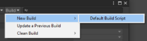

# Groups

组是 Addressables 系统的主要组织单位。使用[Addressables Groups window](https://docs.unity3d.com/Packages/com.unity.addressables@1.19/manual/Groups.html#groups-window)创建和管理您的组及其包含的资产。

您可以将您的可寻址对象组织成组并给每个组分配不同得设置，以控制创建内容构建时资产的处理方式。有关组织资产的方法的信息，请参阅 [Organizing Addressable Assets](https://docs.unity3d.com/Packages/com.unity.addressables@1.19/manual/AddressableAssetsDevelopmentCycle.html#organizing-addressable-assets)。

当您执行内容构建时，构建脚本会创建包含组中资产的 AssetBundle。构建决定了要创建的包的数量以及从 [settings of the group](https://docs.unity3d.com/Packages/com.unity.addressables@1.19/manual/GroupSettings.html#group-settings)和您的整体 [Addressables system settings](https://docs.unity3d.com/Packages/com.unity.addressables@1.19/manual/AddressableAssetSettings.html)创建它们的位置。有关更多信息，请参阅 [Builds](https://docs.unity3d.com/Packages/com.unity.addressables@1.19/manual/Builds.html)。

**NOTE**
*可寻址组仅存在于 Unity 编辑器中。Addressables 运行时代码不使用组概念。但是，如果您要查找并加载属于该组的所有资产，则可以为该组中的资产分配标签。有关使用标签选择要加载的资产的更多信息，请参阅**[Loading Addressable assets](https://docs.unity3d.com/Packages/com.unity.addressables@1.19/manual/LoadingAddressableAssets.html)**。*

## Managing groups

打开可寻址组窗口（菜单： **Window > Asset Management > Addressables > Groups**）来管理您的组和可寻址资产。有关此窗口的信息和功能的详细信息，请参阅[Addressables Groups window](https://docs.unity3d.com/Packages/com.unity.addressables@1.19/manual/Groups.html#groups-window)。

### Create a group

要创建组：

1. 打开 Adressables Group 窗口（菜单：**Window > Asset Management > Addressables > Groups**）。
2. 点击 **Create** 工具栏在窗口打开创建菜单的顶部。
3. 选择**Group > Packed Asset**创建一个新组。（如果您创建了自己的 [Group Templates](https://docs.unity3d.com/Packages/com.unity.addressables@1.19/manual/GroupSettings.html#group-templates)它们也会显示在菜单中。）
4. 选择新组并打开其上下文菜单（right 或 cmd 单击名称）。
5. 选择 **Rename** 并分配所需的名称。
6. 再次打开上下文菜单并选择**Inspect Group Settings**。
7. 根据需要调整组设置。

对于包含您计划与主应用程序一起分发的资产的组，默认设置是一个合理的起点。对于包含您计划远程分发的资产的组，您必须更改构建和加载路径以使用[Profile](https://docs.unity3d.com/Packages/com.unity.addressables@1.19/manual/AddressableAssetsProfiles.html)路径变量的远程版本。（要为远程分发构建 AssetBundles，您还必须在 [Addressable System Settings](https://docs.unity3d.com/Packages/com.unity.addressables@1.19/manual/AddressableAssetSettings.html)启用**Build Remote Catalog**选项。）

有关单个设置的更多信息，请参阅 [Group settings](https://docs.unity3d.com/Packages/com.unity.addressables@1.19/manual/GroupSettings.html#group-settings)。

### Manage assets in a group

#### 将资产添加到组

执行以下操作之一：

- 将资源从 Project 窗口拖到 Group 窗口，将它们放入所需的组中。
- 将资产从一组拖到另一组。
- 检查资产的检查器窗口中的 **Addressables** 选项以将资产添加到默认组。（使用组上下文菜单更改指定为默认组的组。）
- 将包含资产的文件夹添加到一个组中（添加到文件夹中的所有资产都包含在该组中）。

**NOTE**

*如果将 Resources 文件夹中的资产添加到组中，Addressables 系统首先将资产移动到非 Resources 位置。您可以将资产移动到其他地方，但可寻址资产不能存储在项目的 Resources 文件夹中。*

#### To remove assets

在 Groups 窗口中选择一项或多项资产，然后从上下文菜单中选择**Remove Addressables**（或按 Delete 键）。

#### To find an asset

要在 Groups 窗口中定位可寻址资产，请在 Groups 窗口工具栏上的过滤器控件中键入其全部或部分地址、路径或标签。

*Filtering the group list by the string "NP" to find all assets labeled NPC*

要在您的项目中找到资产，请在 Groups 窗口中单击它。Unity 在项目窗口中选择资产并显示资产的检查器。

**TIP**

- 要查看找到组的资产，请启用**Hierarchical Search**；禁用此选项以仅显示与搜索字符串匹配的组。单击搜索框中的放大镜图标以启用或禁用**Hierarchical Search**。
- 要查看子对象地址，例如 Sprite Atlas 中的 Sprite，请使用 Groups 窗口工具栏上的 **Tools** 菜单启用**Show Sprite and Subobject Addresses**选项。

#### To add or remove labels

在 Groups 窗口中选择一项或多项资产，然后单击所选资产之一的标签字段。

*Assigning labels*

要分配标签，请选中或取消选中所需标签的复选框。

单击**Manage Labels**按钮以添加、删除或重命名标签。有关如何使用标签的更多信息，请参阅 [Labels](https://docs.unity3d.com/Packages/com.unity.addressables@1.19/manual/Labels.html)。

## Groups window

使用组窗口来管理您的组和可寻址资产。

Groups 窗口还用作启动内容构建和访问 Addressables 系统的工具和设置的中心位置。

*The Addressables Groups window showing the toolbar and list of groups and assets.*

### Group list

组列表显示项目中的可寻址组。展开列表中的组以显示其包含的资产。您还可以展开复合资产，例如 Sprite 表，以显示它们包含的子对象。

当您第一次安装 Addressables 包时，Groups 窗口会显示两组资产：

- **Built In Data**：包含任何Project Resource文件夹中的资产以及Build Settings列表中包含的任何场景。（除非从Resource或场景列表中删除，否则这些资产都不能是可寻址的。）
- **Default Local Group (Default)**：最初为空，您使可寻址的任何资产都添加到该组中。该组的设置使其资产构建到您的本地构建路径并包含在您的项目构建中。如果需要，您可以更改名称、设置并将另一个组设为默认组。

列表列包含以下信息：

| Column                                | Purpose                                                      |
| :------------------------------------ | :----------------------------------------------------------- |
| **Group Name** \ **Addressable Name** | 项目的名称。对于组，这是您可以分配的任意名称。对于资产，这是可寻址地址。您可以使用上下文菜单编辑名称或地址。 |
| **Icon**                              | 基于资产类型的 Unity 资产图标。                              |
| **Path**                              | 项目中源资产的路径。                                         |
| **Labels**                            | 显示分配给资产的任何标签。单击标签条目以更改分配的标签或管理您的标签定义。 |

您可以通过单击列标题之一对组列表中显示的资产进行排序。这会对每个组内的资产进行排序，但不会对组本身重新排序。您可以通过将组拖到所需位置来更改组的显示顺序。

### Group context menu

打开组上下文菜单（右键或 Cmd 单击组名称）以访问与组相关的命令：

*The Group content menu*

| Command                        | Action                                                       |
| :----------------------------- | :----------------------------------------------------------- |
| **Remove Group(s)**            | 删除组（删除其 ScriptableObject 资产）。组中的任何资产都恢复为不可寻址。 |
| **Simplify Addressable Names** | 通过删除类似路径的组件和扩展来缩短组中资产的名称。           |
| **Set as Default**             | 将组指定为默认组。当您在没有明确分配组的情况下将资产标记为可寻址时，它会被添加到默认组中。 |
| **Inspect Group Settings**     | 在 Unity Project 窗口和 Inspector 中选择组资产，以便您可以查看设置。 |
| **Rename**                     | 允许您编辑名称。                                             |
| **Create New Group**           | 根据组模板创建一个新组。                                     |

### Asset context menu

打开可寻址资产上下文菜单（右键或 Cmd 单击资产地址）以访问与资产相关的命令：

*Addressable Asset context menu*

| Command                            | Action                                                       |
| :--------------------------------- | :----------------------------------------------------------- |
| **Move Addressables to Group**     | 将所选资产移至不同的现有组。                                 |
| **Move Addressables to New Group** | 创建一个与当前组具有相同设置的新组，并将选定的资产移动到该组中。 |
| **Remove Addressables**            | 从组中删除选定的资产并使其不可寻址。                         |
| **Simplify Addressable Names**     | 通过删除类似路径的组件和扩展来缩短所选资产的名称。           |
| **Copy Address to CLipboard**      | 将分配的地址字符串复制到您的系统剪贴板，以便您可以将其粘贴到另一个字段中。 |
| **Change Address**                 | 允许您编辑名称。                                             |
| **Create New Group**               | 根据组模板创建一个新组。（不移动选定的资产。）               |

## Groups window toolbar

Addressables Group 窗口顶部的工具栏提供对以下命令和工具的访问：

### Create

创建一个组。

为组选择模板或为无架构选择空白。

有关创建自己的模板的信息，请参阅[Group templates](https://docs.unity3d.com/Packages/com.unity.addressables@1.19/manual/GroupSettings.html#group-templates)模板。

### Profile

设置活动配置文件以确定用于构建和加载可寻址对象的路径。

选择现有配置文件或选择**Manage Profiles**以打开“配置文件”窗口。

有关详细信息，请参阅 [Profiles](https://docs.unity3d.com/Packages/com.unity.addressables@1.19/manual/AddressableAssetsProfiles.html)。

### Tools

从设置窗口和工具菜单中进行选择。

- **Inspect System Settings**: open the [Addressables Settings](https://docs.unity3d.com/Packages/com.unity.addressables@1.19/manual/AddressableAssetSettings.html) Inspector.
- **Check for Content Update Restrictions**: run a pre-update content check. See [Content Workflow: Update Restrictions](https://docs.unity3d.com/Packages/com.unity.addressables@1.19/manual/ContentUpdateWorkflow.html#settings) for more information.
- Window: open other Addressables system windows:
  - **Profiles**: open the [Profiles](https://docs.unity3d.com/Packages/com.unity.addressables@1.19/manual/AddressableAssetsProfiles.html) window.
  - **Labels**: open the [Labels](https://docs.unity3d.com/Packages/com.unity.addressables@1.19/manual/Labels.html) window.
  - **Analyze**: open the [Analyze](https://docs.unity3d.com/Packages/com.unity.addressables@1.19/manual/AnalyzeTool.html) tool
  - **Hosting Services**: open the [Hosting](https://docs.unity3d.com/Packages/com.unity.addressables@1.19/manual/AddressableAssetsHostingServices.html) window.
  - **Event Viewer**: open the [Event Viewer](https://docs.unity3d.com/Packages/com.unity.addressables@1.19/manual/EventViewer.html) window.
- Groups View: set Group window display options:
  - **Show Sprite and Subobject Addresses**: whether to show Sprite and subobjects in the Group list or just the parent object.
  - **Group Hierarchy with Dashes**: when enabled, the Groups window displays groups that contain dashes '-' in their names as if the dashes represented a group hierarchy. For example, if you name two groups "x-y-z" and "x-y-w", the the window shows an entry called "x" with a child called "y", which contains two groups, called "x-y-z" and "x-y-w". Enabling this option affects the group display only.
- **Convert Legacy AssetBundles**: Assigns non-Addressable assets to Addressable groups based on their current AssetBundle settings.

### Play Mode Script

设置活动的播放模式脚本。

活动的播放模式脚本决定了如何在编辑器播放模式中加载可寻址对象。有关更多信息，请参阅 [Play Mode Scripts](https://docs.unity3d.com/Packages/com.unity.addressables@1.19/manual/Groups.html#play-mode-scripts)。

### Build Script

选择内容构建命令。

- **New Build**: choose a build script to run a full content build.
- **Update a Previous Build**: run a differential update based on an earlier build.
- **Clean Build**: choose a command to clean existing build artifacts.

有关更多信息，请参阅[Builds](https://docs.unity3d.com/Packages/com.unity.addressables@1.19/manual/Builds.html)。

### Filter list

在组列表中查找与指定字符串匹配的项目。

如果指定的字符串与列表中任何列中文本的任何部分匹配，则显示一个项目。

单击放大镜图标可启用或禁用**Hierarchical Search**，它会在指定的组内显示结果，而不是显示为平面列表。

## Play Mode Scripts

当您在编辑器播放模式下运行游戏时，活动的播放模式脚本确定可寻址系统如何访问可寻址资产。当您选择播放模式脚本时，它会一直保持活动脚本，直到您选择不同的脚本为止。当您在编辑器外构建和运行应用程序时，播放模式脚本对资产加载没有影响。

播放模式脚本包括：

- **Use Asset Database**：直接从编辑器资产数据库（也用于所有不可寻址资产）加载资产。使用此选项时，您不必构建可寻址内容。
- **Simulate Groups**：分析布局和依赖项的内容，而无需创建 AssetBundles。通过 ResourceManager 从资产数据库加载资产，就像它们是通过包加载一样。通过引入时间延迟来模拟远程 AssetBundles 的下载速度和本地包的文件加载速度。您可以在此播放模式脚本中使用 [Event Viewer](https://docs.unity3d.com/Packages/com.unity.addressables@1.19/manual/EventViewer.html)。有关配置选项，请参阅[ProjectConfigData](https://docs.unity3d.com/Packages/com.unity.addressables@1.19/api/UnityEditor.AddressableAssets.Settings.ProjectConfigData.html)。
- **Use Existing Build**：从早期内容构建创建的包中加载资产。在使用此选项之前，您必须使用构建脚本（例如 [Default Build Script](https://docs.unity3d.com/Packages/com.unity.addressables@1.19/manual/Builds.html))运行完整构建。远程内容必须托管在用于构建内容的[Profile](https://docs.unity3d.com/Packages/com.unity.addressables@1.19/manual/AddressableAssetsProfiles.html)的**RemoteLoadPath**中。

