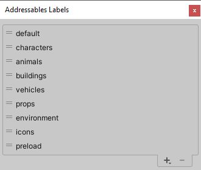

# Labels

您可以在 [Groups](https://docs.unity3d.com/Packages/com.unity.addressables@1.19/manual/Groups.html)窗口中使用一个或多个标签标记您的可寻址资产。标签在 Addressables 系统中有一些用途，包括：

- 您可以使用一个或多个标签作为键来标识在运行时加载哪些资产。
- 您可以根据分配的标签将组中的资产打包到 AssetBundles 中。
- 您可以使用“组”窗口的过滤器框中的标签来帮助查找带标签的资产

当您使用标签列表加载资产时，您可以指定是要加载具有列表中*任何*标签的所有资产，还是仅加载具有列表中*每个*标签的资产。例如，如果您使用的标签，“characters”和“animals”到负载的资产，你可以选择加载这两组资产的并集，其中包括所有的 characters 和所有的 animals，或两组的*交集*，其中仅包括characters 中是 animals。有关更多信息，请参阅 [Loading multiple assets](https://docs.unity3d.com/Packages/com.unity.addressables@1.19/manual/LoadingAddressableAssets.html#loading-multiple-assets) 。

当您选择根据分配的标签（使用组 [Bundle Mode](https://docs.unity3d.com/Packages/com.unity.addressables@1.19/manual/GroupSettings.html#advanced-options)设置）将资产打包到组中时，Addressables 构建脚本会为组中每个唯一的标签组合创建一个捆绑包。例如，如果您在一个组中拥有标记为“cat”或“dog”以及“small”或“large”的资产，则构建会生成四个捆绑包：一个用于 small cats，一个用于 small dogs，一个用于用于large cats，另一种用于 large dogs。

## Managing labels

在标签窗口中创建和删除标签。从 **Groups** 窗口工具栏上的 **Tools** 菜单打开 **Labels** 窗口。

*The Labels window*

要创建新标签，请单击列表底部的**+**按钮。输入新名称并点击**Save**。

要删除标签，请在列表中选择它，然后单击**-**按钮。删除标签也会将其从所有资产中删除。

**TIP**

在运行 Addressables 构建之前，您可以通过将标签添加回 Labels 对话框（使用完全相同的字符串）来撤消对标签的删除。这也将标签添加回其原始资产。但是，在运行 Addressables 构建后，重新添加已删除的 Labels 不再将其重新应用于任何资产。