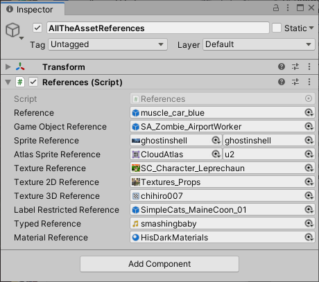

# Asset References

一个[AssetReference](https://docs.unity3d.com/Packages/com.unity.addressables@1.19/api/UnityEngine.AddressableAssets.AssetReference.html)是可以引用一个可寻址的资源类型。

在 MonoBehaviour 或 ScriptableObject 中使用 AssetReference 类。当您将可序列化的 AssetReference 字段添加到这些类之一时，您可以在 Inspector 窗口中为该字段分配一个值。您可以按类型和标签限制可分配给字段的资产。

*An Inspector window showing several AssetReference fields*

要分配值，请将资产拖到该字段或单击对象选择器图标以打开一个对话框，让您选择可寻址资产。

如果您将不可寻址资产拖到 AssetReference 字段，系统会自动使资产可寻址并将其添加到您的默认可寻址组。Sprite 和 SpriteAtlas 资产可以有子对象。分配给这些类型资产的 AssetReferences 显示一个额外的对象选择器，允许您指定要引用的子对象。

有关在项目中使用 AssetReferences 的示例，请参阅[Addressables-Sample](https://github.com/Unity-Technologies/Addressables-Sample)存储库中的[Basic AssetReference](https://github.com/Unity-Technologies/Addressables-Sample/tree/master/Basic/Basic AssetReference)、[Component Reference](https://github.com/Unity-Technologies/Addressables-Sample/tree/master/Basic/ComponentReference)和[Sprite Land](https://github.com/Unity-Technologies/Addressables-Sample/tree/master/Basic/Sprite Land)项目。

**IMPORTANT**

为了能够将组中的资产分配给 AssetReference 字段，必须在组的高级设置中启用在**Include GUID in Catalog**选项。**Include GUID in Catalog**选项是默认启用的。

## AssetReference types

Addressables API为常见类型的资产提供[AssetReference](https://docs.unity3d.com/Packages/com.unity.addressables@1.19/api/UnityEngine.AddressableAssets.AssetReference.html)子类。您可以使用通用子类[AssetReferenceT](https://docs.unity3d.com/Packages/com.unity.addressables@1.19/api/UnityEngine.AddressableAssets.AssetReferenceT-1.html)将 AssetReference 字段限制为其他资产类型。

AssetReference 的类型包括：

- [AssetReference](https://docs.unity3d.com/Packages/com.unity.addressables@1.19/api/UnityEngine.AddressableAssets.AssetReference.html): can reference any asset type
- [AssetReferenceT](https://docs.unity3d.com/Packages/com.unity.addressables@1.19/api/UnityEngine.AddressableAssets.AssetReferenceT-1.html): can reference assets that are the same type as `TObject`
- [AssetReferenceTexture](https://docs.unity3d.com/Packages/com.unity.addressables@1.19/api/UnityEngine.AddressableAssets.AssetReferenceTexture.html): can reference a [Texture](https://docs.unity3d.com/2019.4/Documentation/ScriptReference/Texture.html) asset
- [AssetReferenceTexture2D](https://docs.unity3d.com/Packages/com.unity.addressables@1.19/api/UnityEngine.AddressableAssets.AssetReferenceTexture2D.html): can reference a [Texture2D](https://docs.unity3d.com/2019.4/Documentation/ScriptReference/Texture2D.html) asset
- [AssetReferenceTexture3D](https://docs.unity3d.com/Packages/com.unity.addressables@1.19/api/UnityEngine.AddressableAssets.AssetReferenceTexture3D.html): can reference a [Texture3D](https://docs.unity3d.com/2019.4/Documentation/ScriptReference/Texture3D.html) asset
- [AssetReferenceGameObject](https://docs.unity3d.com/Packages/com.unity.addressables@1.19/api/UnityEngine.AddressableAssets.AssetReferenceGameObject.html): can reference a [Prefab](https://docs.unity3d.com/2019.4/Documentation/Manual/Prefabs.html) asset
- [AssetReferenceAtlasedSprite](https://docs.unity3d.com/Packages/com.unity.addressables@1.19/api/UnityEngine.AddressableAssets.AssetReferenceAtlasedSprite.html): can reference a [SpriteAtlas](https://docs.unity3d.com/2019.4/Documentation/Manual/class-SpriteAtlas.html) asset
- [AssetReferenceSprite](https://docs.unity3d.com/Packages/com.unity.addressables@1.19/api/UnityEngine.AddressableAssets.AssetReferenceSprite.html): can reference a single [Sprite](https://docs.unity3d.com/2019.4/Documentation/Manual/Sprites.html) asset

**NOTE**

如果要将[CustomPropertyDrawer](https://docs.unity3d.com/2019.4/Documentation/Manual/editor-PropertyDrawers.html)与通用 AssetReferenceT 一起使用（或使用早于 2020.1 的 Unity 版本），则必须创建一个具体的子类以支持自定义 AssetReference 类型。

## Adding AssetReference fields to a class

通过将[AssetReference](https://docs.unity3d.com/Packages/com.unity.addressables@1.19/api/UnityEngine.AddressableAssets.AssetReference.html)或其子类之一声明为类的可序列化字段，将[AssetReference](https://docs.unity3d.com/Packages/com.unity.addressables@1.19/api/UnityEngine.AddressableAssets.AssetReference.html)或其子类之一添加到 MonoBehaviour 或 ScriptableObject：

**NOTE**

在 Unity 2020.1 之前，Inspector 窗口默认无法显示通用字段。在 Unity 的早期版本中，您必须创建自己的 AssetReferenceT 的非通用子类。请参阅[创建具体的子类](https://docs.unity3d.com/Packages/com.unity.addressables@1.19/manual/AssetReferences.html#creating-a-concrete-subclass)。

## Loading and releasing AssetReferences

该[AssetReference](https://docs.unity3d.com/Packages/com.unity.addressables@1.19/api/UnityEngine.AddressableAssets.AssetReference.html)类提供自己的方法来加载，实例化，并释放被引用的资产。您还可以使用 AssetReference 实例作为键通过任何[Addressables](https://docs.unity3d.com/Packages/com.unity.addressables@1.19/api/UnityEngine.AddressableAssets.Addressables.html)类方法加载资产。

以下示例将 AssetReference 实例化为当前 GameObject 的子项，并在父项被销毁时释放它：

有关使用 AssetReferences 加载资产的更多信息和示例，请参阅 [Loading an AssetReference](https://docs.unity3d.com/Packages/com.unity.addressables@1.19/manual/LoadingAddressableAssets.html#loading-an-assetreference)。

## Restricting AssetReference assignment to assets with specific labels

使用[AssetReferenceUILabelRestriction](https://docs.unity3d.com/Packages/com.unity.addressables@1.19/api/UnityEngine.AssetReferenceUILabelRestriction.html)属性将您可以分配给[AssetReference](https://docs.unity3d.com/Packages/com.unity.addressables@1.19/api/UnityEngine.AddressableAssets.AssetReference.html)字段的资产限制为具有特定标签的资产。除了 AssetReference 子类之外，您还可以使用此属性引用来限制类型和标签的分配。

以下示例阻止某人将可寻址资产分配给没有标签“animals”或标签“characters”的引用：

**NOTE**

- 该属性仅防止使用 Unity 编辑器中的检查器分配没有指定标签的资产。有人仍然可以使用脚本将没有标签的资产分配给该字段。
- 您不能将不可寻址资产拖到具有该`AssetReferenceUILabelRestriction`属性的字段中。

## Creating a concrete subclass

对于无法直接使用[AssetReference](https://docs.unity3d.com/Packages/com.unity.addressables@1.19/api/UnityEngine.AddressableAssets.AssetReference.html)类的通用形式的情况（在 Unity 202.1 之前的 Unity 版本中或使用[CustomPropertyDrawer](https://docs.unity3d.com/2019.4/Documentation/Manual/editor-PropertyDrawers.html)属性时），您可以创建一个具体的子类。

要创建具体的子类，请从[AssetReferenceT](https://docs.unity3d.com/Packages/com.unity.addressables@1.19/api/UnityEngine.AddressableAssets.AssetReferenceT-1.html)类继承并指定资产类型。您还必须将 GUID 字符串传递给基类构造函数：

您可以在另一个脚本中以与其他 AssetReference 类型相同的方式使用您的自定义 AssetReference 子类：