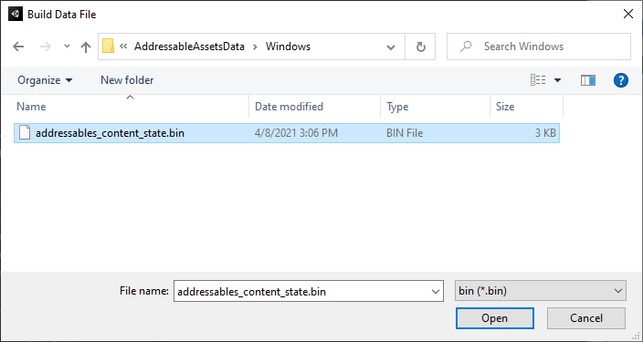

# Making builds

当您使用 Addressables 包时，您可以将内容 (AssetBundles) 构建为与应用程序播放器不同的步骤。Addressables 包为此目的提供了自己的构建脚本，可从 [Groups window](https://docs.unity3d.com/Packages/com.unity.addressables@1.19/manual/Groups.html#groups-window)的工具栏访问。

构建项目时，您有两个选择。您可以将 Addressables 内容构建为 Player 构建的一部分，也可以将它们作为单独的步骤构建。

## Making a full build

要构建您的内容工件：

1. 配置您的组设置。
2. 如果您要远程分发内容，请配置您的配置文件和可寻址系统设置以启用远程内容分发。
3. 选择正确的配置文件。
4. 从 [Groups window](https://docs.unity3d.com/Packages/com.unity.addressables@1.19/manual/Groups.html#groups-window)启动构建。

**TIP**

*如果在开发过程中遇到构建或运行时加载问题，请考虑在重建内容之前从 **Build** 菜单运行**Clean > All**命令。*

### Setting up build and load paths

[Profile](https://docs.unity3d.com/Packages/com.unity.addressables@1.19/manual/AddressableAssetsProfiles.html)定义的本地与远程内容构建和负载路径不同的变量。您可以创建多个配置文件，以便为不同类型的构建使用不同的路径。例如，您可以在编辑器中开发项目时使用一个配置文件，在发布最终内容构建时使用另一个配置文件。

对于大多数项目，当您支持远程内容分发时，您只需要多个配置文件。您通常不需要在开发过程的不同阶段更改本地路径。大多数项目应该将本地内容构建到默认的本地构建路径，并从默认的本地加载路径（解析为 StreamingAssets 文件夹）加载它。

#### Default local paths

本地构建路径默认为[Addressables.BuildPath](https://docs.unity3d.com/Packages/com.unity.addressables@1.19/api/UnityEngine.AddressableAssets.Addressables.BuildPath.html#UnityEngine_AddressableAssets_Addressables_BuildPath)提供的路径，它位于 Unity 项目的 Library 文件夹中。Addressables 根据您当前的平台构建目标设置将文件夹附加到本地构建路径。当您为多个平台构建时，构建会将每个平台的工件放在不同的子文件夹中。

同样，本地加载路径默认为[Addressables.RuntimePath](https://docs.unity3d.com/Packages/com.unity.addressables@1.19/api/UnityEngine.AddressableAssets.Addressables.RuntimePath.html#UnityEngine_AddressableAssets_Addressables_RuntimePath)提供的路径，解析为 StreamingAssets 文件夹。再次 Addressables 将平台构建目标添加到路径中。

当您将本地包构建到默认构建路径时，构建代码会在您构建播放器时临时将工件从构建路径复制到 StreamingAssets 文件夹（并在构建后删除它们）。

**WARNING**

*如果您构建到自定义本地路径或从自定义本地路径加载，则您有责任在进行播放器构建之前将构建工件复制到项目中的正确位置，并确保您的应用程序可以在运行时访问这些工件。*

#### Default remote paths

Addressables 将默认远程构建路径设置为任意选择的文件夹名称“ServerData”，该名称是在您的项目文件夹下创建的。构建将当前平台目标作为子文件夹添加到路径中，以分离不同平台的独特工件。

默认远程加载路径是“ http://localhost/ ”，附加了当前配置文件 BuildTarget 变量。您必须将此路径更改为计划加载可寻址资产的基本 URL。

根据您正在进行的开发、测试或发布类型，使用不同的配置文件来设置远程加载路径。例如，您可以有一个配置文件从 localhost 服务器加载资产用于一般开发构建，一个配置文件从临时环境加载资产用于 QA 构建，还有一个配置文件从您的内容交付网络 (CDN) 加载资产用于发布构建。见[Hosting](https://docs.unity3d.com/Packages/com.unity.addressables@1.19/manual/AddressableAssetsHostingServices.html)有关配置主机的更多信息。

**NOTE**

*在编辑器中运行游戏时，您可以使用 **Use Asset Database** 播放模式脚本绕过通过远程或本地加载路径加载资产。这很方便，尤其是当您没有设置本地主机服务器时。但是，它可以隐藏组配置和资产分配错误。*

### Setting up remote content builds

要设置远程内容构建：

1. 导航到您的 AdressablesSystemSetting 资产（菜单：**Window > Asset Management > Addressables > Settings**）。
2. 在**Catalog** 下，启用**Build Remote Catalog**选项。目录的**BuildPath**和**LoadPath**设置必须与用于远程组的设置相同。在大多数情况下，使用 RemoteBuildPath 和 RemoteLoadPath 配置文件变量。
3. 对于要构建为远程内容的每个组，将**BuildPath**和**LoadPath**设置为 RemoteBuildPath 和 RemoteLoadPath 配置文件变量（或自定义值，如果需要）。
4. 打开 [Profiles window](https://docs.unity3d.com/Packages/com.unity.addressables@1.19/manual/AddressableAssetsProfiles.html)（菜单：**Window > Asset Management > Addressables > Profiles**）。
5. 将 RemoteLoadPath 变量设置为您计划托管远程内容的 URL。如果不同类型的构建需要不同的 URL，请为每种构建类型创建一个新的配置文件。有关详细信息，请参阅[Profiles](https://docs.unity3d.com/Packages/com.unity.addressables@1.19/manual/AddressableAssetsProfiles.html) 和 [Hosting](https://docs.unity3d.com/Packages/com.unity.addressables@1.19/manual/AddressableAssetsHostingServices.html)。

有关其他信息，请参阅 [Remote content distribution](https://docs.unity3d.com/Packages/com.unity.addressables@1.19/manual/RemoteContentDistribution.html)。

### Performing the build

配置组和可寻址系统设置后，您可以运行内容构建：

1. 打开 [Groups window](https://docs.unity3d.com/Packages/com.unity.addressables@1.19/manual/Groups.html#groups-window)（菜单：**Windows > Asset Management > Addressables > Groups**）。
2. 从工具栏上的配置 **Profile** 菜单中选择所需的配置文件。
3. 从**Build > New Build**菜单中选择**Default Build Script**。（如果您已经创建了自己的构建脚本，它们也可以从此菜单中使用。）

默认构建脚本为每个组创建一个或多个 AssetBundle 并将它们保存到本地或远程构建路径。

## Making an update build

当您远程分发内容时，您可以对先前发布的构建执行差异更新，以最大限度地减少用户必须下载的数据量（与完整构建相比）。

正确配置远程组并拥有包含远程内容的先前构建后，您可以通过以下方式执行内容更新构建：

1. 打开[Groups 窗口](https://docs.unity3d.com/Packages/com.unity.addressables@1.19/manual/Groups.html#groups-window) （菜单：**Windows > Asset Management > Addressables > Groups**）。

2. 从工具栏上的配置 **Profile** 菜单中选择所需的配置文件。

3. 从**Build**菜单中选择**Update a Previous Build**。 *文件选择器对话框打开。*

   

4. 找到`addressables_content_state.bin`您正在更新的构建生成的文件。（默认位置在您的`Assets/AddressableAssetsData/TargetPlatform`文件夹中。）

5. 单击 **Open** 以启动更新构建。

要更新现有客户端，请将更新的远程内容复制到您的托管服务（经过适当测试）。（更新版本确实包括您所有的本地和远程内容——您在内容更新版本之后创建的任何播放器版本都将包含一组完整的可寻址资产。）

请注意，更新以前的构建不会更改`addressables_content_state.bin`文件。使用相同版本的文件进行未来的更新构建（直到您发布从 **New Build** 菜单创建的另一个完整构建）。

有关如何以及何时使用内容更新版本的信息，请参阅[Content Update Builds](https://docs.unity3d.com/Packages/com.unity.addressables@1.19/manual/ContentUpdateWorkflow.html) 。

