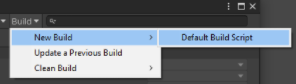

# Building content

内容构建处理您的可寻址组以生成内容目录和包含您的资产的 AssetBundles。

您可以配置 Addressables 系统以将您的 Addressables 内容构建为每个 Player 构建的一部分，或者您可以在进行 Player 构建之前单独构建您的内容。有关配置这些选项的更多信息，请参阅 [Building Addressables content with Player builds](https://docs.unity3d.com/Packages/com.unity.addressables@1.19/manual/Builds.html#build-with-player)。

如果您将 Unity 配置为作为播放器构建的一部分构建您的内容，请使用编辑器[Build Settings](https://docs.unity3d.com/2019.4/Documentation/Manual/PublishingBuilds.html)窗口上的正常 **Build** 或 **Build and Run** 按钮开始构建。您还可以在命令行上调用编辑器，传入`-buildPlatformPlayer`其中一个选项或使用诸如[BuildPipeline.BuildPlayer](https://docs.unity3d.com/2019.4/Documentation/ScriptReference/BuildPipeline.BuildPlayer.html)之类的 API来启动构建。在所有情况下，Unity 都会在构建播放器之前构建您的可寻址内容作为预构建步骤。

如果您将 Unity 配置为单独构建您的内容，您必须使用**Addressables Groups**窗口上的**Build**菜单启动 Addressables 构建，如 [Making builds](https://docs.unity3d.com/Packages/com.unity.addressables@1.19/manual/BuildingContent.html)。下次为项目构建播放器时，它会使用预先为当前平台运行的可寻址内容构建生成的工件。有关自动化 Addressables 构建过程的信息，请参阅 [Build scripting](https://docs.unity3d.com/Packages/com.unity.addressables@1.19/manual/BuildPlayerContent.html) 。

您的内容构建可以生成两大类内容：

- **Local content**：直接包含在您的播放器构建中的内容。只要您使用本地内容的默认构建路径，Addressables 系统就会自动管理本地内容。如果更改本地构建路径，则必须在进行 Player 构建之前将工件从本地构建路径复制到`Assets/StreamingAssets`项目文件夹。
- **Remote content**：安装应用程序后从 URL 下载的内容。您有责任将远程内容上传到托管服务器，以便您的应用程序可以通过指定的 URL（由您的[RemoteLoadPath](https://docs.unity3d.com/Packages/com.unity.addressables@1.19/manual/AddressableAssetsProfiles.html)指定）访问它。

您的[Group settings](https://docs.unity3d.com/Packages/com.unity.addressables@1.19/manual/GroupSettings.html)决定了群组属于哪个类别；激活的 [Profile](https://docs.unity3d.com/Packages/com.unity.addressables@1.19/manual/AddressableAssetsProfiles.html)确定可寻址系统用于构建和加载内容的特定路径和 URL。（您的 [Addressable Asset settings](https://docs.unity3d.com/Packages/com.unity.addressables@1.19/manual/AddressableAssetSettings.html)还包含影响您的内容构建的选项，例如是否完全构建远程内容。）

您可以从脚本以及 **Groups** 窗口开始构建。有关更多信息，请参阅 [Build scripting](https://docs.unity3d.com/Packages/com.unity.addressables@1.19/manual/BuildPlayerContent.html)。

Addressables 系统包括以下构建脚本：

- **Default Build Script**：根据组、配置文件和可寻址系统设置执行完整的内容构建。
- **Update a Previous Build**：执行差异内容构建以更新先前创建的构建。
- **Play Mode scripts**：播放模式脚本在技术上是构建脚本并控制编辑器如何在播放模式下访问您的内容。有关更多信息，请参阅 [Play Mode Scripts](https://docs.unity3d.com/Packages/com.unity.addressables@1.19/manual/Groups.html#play-mode-scripts)。

构建脚本还提供了清除它们创建的缓存文件的功能。您可以从 [Groups window](https://docs.unity3d.com/Packages/com.unity.addressables@1.19/manual/Groups.html#groups-window)的**Build > Clean Build**菜单运行这些函数。

## Building Addressables content with Player builds

在开发期间修改可寻址资产时，您必须在构建播放器之前重建可寻址内容。您可以在构建 Player 之前将 Addressables 内容构建作为单独的步骤运行，也可以同时运行 Addressables 内容构建和 Player 构建。

与播放器一起构建可寻址内容可能很方便，但确实会增加构建时间，尤其是在大型项目中，因为即使您没有修改任何资产，这也会重建可寻址内容。如果您不在大多数构建之间更改 Addressables 内容，请考虑禁用此选项。

Project [Addressable Asset Settings ](https://docs.unity3d.com/Packages/com.unity.addressables@1.19/manual/AddressableAssetSettings.html#build)中的**Build Addressables on Player Build** 设置指定了用于构建 Addressables 内容的选项。您可以为每个项目选择适当的选项或遵循全局首选项设置（您可以在Unity 编辑器首选项的 **Addressables** 部分中找到）。当您设置项目级别的设置时，它适用于构建项目的所有贡献者。Preferences 设置适用于所有未设置特定值的 Unity 项目。

**NOTE**

*在 Player Build 上构建可寻址对象需要 Unity 2021.2+。在早期版本的 Unity 中，您必须将 Addressables 内容构建为单独的步骤。*

## Build commands

从 [Groups window](https://docs.unity3d.com/Packages/com.unity.addressables@1.19/manual/Groups.html#groups-window)顶部工具栏上的 **Build** 菜单访问构建命令。

该菜单提供以下项目：

- **New Build**：选择一个构建脚本来运行一个完整的内容构建。Addressables 包包括一个构建脚本，**Default Build Script**。如果您创建自定义构建脚本，您可以在此处访问它们（请参阅 [Build scripting](https://docs.unity3d.com/Packages/com.unity.addressables@1.19/manual/BuildPlayerContent.html)）。
- **Update a Previous Build**：运行基于早期构建的差异更新。当您支持远程内容分发和发布更新的内容时，更新版本可以生成较小的下载。请参阅[Content update builds](https://docs.unity3d.com/Packages/com.unity.addressables@1.19/manual/ContentUpdateWorkflow.html)。
- **Clean Build**：选择一个命令来清理现有的构建缓存文件。每个构建脚本都可以提供一个清理功能，您可以从该菜单中调用该功能。（请参阅 [Build scripting](https://docs.unity3d.com/Packages/com.unity.addressables@1.19/manual/BuildPlayerContent.html)。）

## Build artifacts

构建创建以下文件，这些文件成为播放器构建的一部分：

- Local AssetBundles (.bundle)：根据您的组、配置文件和平台设置
- settings.json：包含运行时使用的可寻址配置数据。
- catalog.json：用于在运行时定位和加载资产的目录（如果没有更新的远程目录可用）。
- link.xml：防止 Unity 链接器剥离您的资产使用的类型。请参阅 [Code Stripping](https://docs.unity3d.com/2019.4/Documentation/Manual/ManagedCodeStripping.html)。

当您构建播放器时，Addressables 系统会将这些文件复制到您的[StreamingAssets](https://docs.unity3d.com/2019.4/Documentation/Manual/StreamingAssets.html)文件夹中，以便将它们包含在您的应用程序中。播放器构建完成后，它会删除文件。

该构建还会创建以下未复制到流资产的文件：

- Remote AssetBundles ( `.bundle`)：根据您的组、配置文件和平台设置。您必须将远程捆绑包上传到您的托管服务器。
- `catalog_timestamp.json`：要上传到您的托管服务器的目录（覆盖本地目录）。如果您在项目 [Addressable Asset settings](https://docs.unity3d.com/Packages/com.unity.addressables@1.19/manual/AddressableAssetSettings.html)启用了 **Build Remote Catalog** 选项，则可寻址构建只会创建远程目录文件。
- `catalog_timestamp.hash`：要上传到您的托管服务器的哈希文件。用于检查自上次客户端应用程序下载以来远程目录是否已更改。
- `addressables_content_state.bin`：用于进行内容更新构建。如果您支持动态内容更新，则必须在您发布的每个完整内容构建后保存此文件。否则，您可以忽略此文件。请参阅[Content update builds](https://docs.unity3d.com/Packages/com.unity.addressables@1.19/manual/ContentUpdateWorkflow.html)。
- `AddressablesBuildTEP.json`: 构建性能数据。请参阅 [Build profiling](https://docs.unity3d.com/Packages/com.unity.addressables@1.19/manual/BuildProfileLog.html)。

