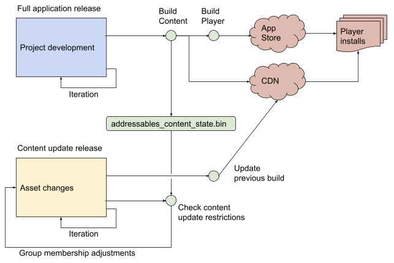

# Content update builds

Addressables 包包括可用于减少远程分发的内容的更新大小的工具。

内容更新工具包括：

- **[Check for Content Update Restrictions](https://docs.unity3d.com/Packages/com.unity.addressables@1.19/manual/ContentUpdateWorkflow.html#check-for-content-update-restrictions-tool)**工具：根据组设置为您的组组织准备内容更新构建
- **[Update a Previous Build](https://docs.unity3d.com/Packages/com.unity.addressables@1.19/manual/ContentUpdateWorkflow.html#building-content-updates)**脚本：执行内容更新构建的构建脚本

**IMPORTANT**

*您必须为以后打算更新的每个构建保存由默认构建脚本生成的**addressables_content_state.bin**文件。每次运行构建脚本时都会更新此文件。请务必保存为您发布的内容构建生成的版本。*

有关如何为内容更新设置可寻址组的信息，请参阅[Group settings](https://docs.unity3d.com/Packages/com.unity.addressables@1.19/manual/ContentUpdateWorkflow.html#settings)。

有关如何执行内容更新构建的信息，请参阅[Building content updates](https://docs.unity3d.com/Packages/com.unity.addressables@1.19/manual/ContentUpdateWorkflow.html#building-content-updates)。

有关内容更新如何工作的一般信息（包括示例），请参阅 [Overview](https://docs.unity3d.com/Packages/com.unity.addressables@1.19/manual/ContentUpdateWorkflow.html#overview)。

**NOTE**

在提供自己的补丁系统（例如 Switch 或 Steam）或不支持远程内容分发的平台上，请勿使用内容更新版本。游戏的每个构建都应该是一个完整的新鲜内容构建。（在这种情况下，您可以丢弃或忽略在每次构建平台后生成的*addressables_content_state.bin*文件。）

## Overview

当您远程分发内容时，您可以更改内容而无需重新构建和重新发布整个应用程序。当 Addressables 系统在运行时初始化时，它会检查更新的内容目录。如果存在，系统会下载新目录，并在加载资产时下载所有资产包的较新版本。

但是，当您使用新的内容目录重建所有内容时，已安装的播放器还必须重新下载所有远程 AssetBundle，无论其中的资产是否已更改。如果您拥有大量内容，重新下载所有内容可能会花费大量时间，并且可能会影响玩家的留存率。为了使这个过程更加高效，Addressables 包提供了一些工具，您可以运行这些工具来识别更改的资产并生成内容更新版本。

下图说明了如何使用 Adressables 工具生成较小的内容更新，只需要您的玩家下载新的或更改的内容：

*workflow for reducing the size of content updates*

当您发布完整的应用程序时，您首先像往常一样构建可寻址内容，然后构建播放器。播放器构建包含您的本地 AssetBundle，您将远程 AssetBundle 上传到您的内容交付网络 (CDN) 或其他托管服务。

生成可寻址内容构建的默认构建脚本始终创建*addressables_content_state.bin*文件，这是有效发布纯内容更新所必需的。您必须为每个已发布的完整应用程序版本（在每个平台上）保存此文件。

在需要您的用户下载并安装新播放器版本的完整应用程序版本之间，您可以更改项目中的可寻址资产。（因为 AssetBundles 不包含代码，所以不要在用于开发资产更改的项目版本中进行代码更改。）您可以更改本地和远程资产。

当您准备好发布内容更新时，请运行**Check Content Update Restrictions**工具。此工具检查*addressables_content_state.bin*文件，并根据更改的资产所在组的设置将更改的资产移动到新的远程组。

要构建更新的 AssetBundles，请运行**Update a Previous Build**脚本。此工具还使用*addressables_content_state.bin*文件。它会重建您的所有内容，但会生成一个修改后的目录，该目录访问原始 AssetBundles 中未更改的内容和新 AssetBundles 中更改的内容。

最后一步是将更新的内容上传到您的 CDN。（您可以上传所有新生成的 AssetBundle 或仅上传更改名称的资产包——未更改的包使用与原始资产相同的名称并将覆盖它们。）

您可以按照相同的过程进行其他内容更新。始终使用原始版本中的*addressables_content_state.bin*文件。

有关分步说明，请参阅 [Building content updates](https://docs.unity3d.com/Packages/com.unity.addressables@1.19/manual/ContentUpdateWorkflow.html#building-content-updates)。

### When a full rebuild is required

Addressables 只能分发内容，不能分发代码。因此，代码更改通常需要全新的播放器构建，并且通常需要全新的内容构建。尽管新的播放器构建有时可以重用 CDN 中旧的现有内容，但您必须仔细分析现有 AssetBundle 中的类型树是否与您的新代码兼容。这是需要仔细探索的高级领域。

请注意，Addressables 本身是代码，因此更新 Addressables 或 Unity 版本可能需要您创建新的播放器构建和新的内容构建。

## Settings

要发布内容更新，您的应用程序必须已经使用远程目录并将其远程内容托管在可访问的服务器上。有关设置内容托管和分发的信息，请参阅 [Enabling remote distribution](https://docs.unity3d.com/Packages/com.unity.addressables@1.19/manual/RemoteContentDistribution.html#enabling-remote-distribution)。

除了启用远程内容分发之外，您还应该考虑如何设置每个组的**Update Restriction**设置。这些设置确定**Check for Content Update Restriction**工具如何处理组中已更改的内容。选择适当的设置以帮助最小化内容更新的下载大小。请参阅[Group Update Restriction settings](https://docs.unity3d.com/Packages/com.unity.addressables@1.19/manual/ContentUpdateWorkflow.html#group-update-restriction-settings)。

如果您想动态更新内容（而不是在应用程序启动时），需要考虑的另一个设置是**Unique Bundle IDs**设置。启用此选项可以更轻松地在应用程序会话中间加载更新的 AssetBundle，但通常会使构建速度变慢并且更新量更大。请参阅 [Unique Bundle IDs setting](https://docs.unity3d.com/Packages/com.unity.addressables@1.19/manual/ContentUpdateWorkflow.html#unique-bundle-ids-setting)。

### Group Update Restriction settings

对于项目中的每个组，将**Update Restriction**设置为：

- Cannot Change Post Release：您希望很少更新的静态内容（如果有的话）。所有本地内容都应使用此设置。
- Can Change Post Release：您希望经常更新的动态内容。

根据组中的内容类型以及您希望更新该内容的频率（在应用程序的完整播放器构建之间）选择设置。

无论您选择哪种设置，您都可以更改组中的内容。不同之处在于**Check for Content Update**和**Update Previous Build**工具如何处理组中的资产，以及最终安装的应用程序如何访问更新的内容。

**IMPORTANT**

*除非您正在执行完整构建，否则不要更改组的**Update Restriction**设置。如果在内容更新之前更改组设置，Addressables 无法生成更新构建所需的正确更改。*

#### Cannot Change Post Release (static content)

当您将组设置为**Cannot Change Post Release**，**Check for Content Updates**工具会将任何更改的资产移动到新组，该组设置为从远程路径构建和加载。当您随后使用**Update a Previous Build**工具构建更新的内容时，它会设置远程目录，以便从新包访问更改的资产，但仍可从原始包访问未更改的资产。

**NOTE**

`*尽管更新版本会生成没有更改资产的原始包的版本，但已安装的应用程序不会下载这些包，除非由于某种原因删除了本地缓存的版本。*`

将您不希望频繁更新的内容组织在设置为**Cannot Change Post Release**。您可以安全地设置这些组以生成更少、更大的包，因为您的用户通常不需要多次下载这些包。

您打算从本地加载路径加载的任何组都应始终设置为**Cannot Change Post Release**。同样，任何生成大型远程捆绑包的组也应设置为**Cannot Change Post Release**，这样您的用户只需在您最终更改这些组中的资产时下载已更改的资产。

#### Can Change Post Release (dynamic content)

当您将组设置为**Can Change Post Release** 时，如果组内的任何资产发生更改，则内容更新会重建整个包。该**Update a Previous Build**脚本设置目录了，这样安装的应用程序加载的所有资产组中的新包。

在设置为**Can Change Post Release** 的组中组织您希望经常更改的内容。由于当任何单个资产发生更改时，这些组中的所有资产都会重新发布，因此您通常应设置这些组以生成包含较少资产的较小捆绑包。

### Unique Bundle IDs setting

该 [Addressable Asset settings](https://docs.unity3d.com/Packages/com.unity.addressables@1.19/manual/AddressableAssetSettings.html)包含一个选项，**Unique Bundle IDs**，影响内容的更新版本。如果在运行时更新应用程序目录时遇到 AssetBundle ID 冲突，您可以评估是否需要启用此选项。

启用**Unique Bundle IDs**选项允许您在原始包仍在内存中时加载 AssetBundle 的更改版本。使用唯一的内部 ID 构建 AssetBundle 可以更轻松地在运行时更新内容，而不会遇到 AssetBundle ID 冲突。

然而，该选项并非没有缺点。启用后，还必须重建包含引用已更改资产的资产的任何 AssetBundle。必须为内容更新更新更多包，并且所有构建都较慢。

在可寻址系统已经初始化并且您已经开始加载资产之后更新内容目录时，您通常只需要使用唯一的包 ID。

您可以使用以下方法之一避免 AssetBundle 加载冲突以及启用唯一 ID 的需要：

- 作为 Addressables 初始化的一部分更新内容目录。默认情况下，Addressables 在初始化时检查新目录（只要您未在可寻址资产设置中启用[Disable Catalog Update on Startup](https://docs.unity3d.com/Packages/com.unity.addressables@1.19/manual/AddressableAssetSettings.html#catalog)选项）。选择此方法确实会阻止在会话中更新您的应用程序内容。
- 在更新内容目录之前卸载所有远程 AssetBundle。卸载所有远程包和资产还可以避免包名称冲突，但可能会在用户等待新内容加载时中断用户的会话。

## Building content updates

要构建内容更新，请运行**Update a Previous Build**脚本：

1. 运行 [Check for Content Update Restrictions](https://docs.unity3d.com/Packages/com.unity.addressables@1.19/manual/ContentUpdateWorkflow.html#check-for-content-update-restrictions-tool)工具。
2. 在 Unity Editor 中打开**Addressables Groups**窗口（**Window** > **Asset Management** > **Addressables** > **Groups**）。
3. 从工具栏上的**Build**菜单中，运行**Update a Previous Build**脚本。
4. 在打开的**Build Data File**对话框中，再次选择`addressables_content_state.bin`由您正在更新的构建生成的文件。
5. 单击**Open** 以启动内容更新构建。

构建生成内容目录、哈希文件和 AssetBundles。

生成的内容目录与原始应用程序构建中的目录同名，覆盖旧目录和哈希文件。应用程序在运行时加载哈希文件以确定新目录是否可用。系统从应用程序附带的或应用程序已经下载的现有包中加载未修改的资产。

系统使用 addressables_content_state.bin 文件中的内容版本字符串和位置信息来创建 AssetBundle。不包含更新内容的资产包使用与为更新选择的构建中的文件名相同的文件名编写。如果 AssetBundle 包含更新的内容，则会生成一个包含更新内容的新包，并具有新的文件名，以便它可以与内容托管服务上的原始内容共存。只有具有新文件名的 AssetBundles 必须复制到托管您的内容的位置（尽管您可以安全地上传它们）。

系统还为无法更改的内容构建 AssetBundle，例如任何本地 AssetBundle，但您不需要将它们上传到内容托管位置，因为没有 Addressables Asset 条目引用它们。

请注意，您不应在构建新播放器和进行内容更新（例如，播放器代码、可寻址）之间更改构建脚本。这可能会导致您的应用程序出现不可预测的行为。

此外，如果您删除您Addressables构建从项目库文件夹中创建的本地内容包，尝试加载资产中，当你在编辑器中运行你的游戏或应用程序的包失败，使用**Use Existing Build (requires built groups)**播放模式脚本。

### Check for Content Update Restrictions tool

在**Check for Content Update Restrictions**工具准备进行内容更新构建您的团体组织。该工具会检查*addressables_content_state.bin*文件和组设置。如果组的**Update Restrictions**选项在之前的版本中设置为**Cannot Change Post Release**，该工具会将任何更改的资产移动到新的远程组。当您创建更新构建时，新目录将更改的资产映射到其新的远程 AssetBundle，同时仍将未更改的资产映射到其原始 AssetBundle。检查内容更新限制不会修改设置为**Can Change Post Release** 的组。

要运行该工具：

1. 在 Unity Editor 中打开**Addressables Groups**窗口（**Window** > **Asset Management** > **Addressables** > **Groups**）。
2. 在组窗口中，从工具栏 **Tools** 菜单运行 **Check for Content Update Restrictions**。
3. 在打开的**Build Data File**对话框中，选择由您正在更新的构建生成的 addressables_content_state.bin 文件。（默认情况下，它位于 Assets/AddressableAssetsData/<platform> 项目目录中，其中 <platform> 是您的目标平台。）
4. 单击 **Open** 以选择文件并启动该工具。
5. 如果需要，请查看该工具所做的组更改。您可以更改该工具创建的任何新远程组的名称，但将资产移动到不同的组可能会产生意想不到的后果。

**Important**：在运行**Check for Content Update Restrictions**工具之前，您应该使用版本控制系统创建一个分支。该工具以适合更新内容的方式重新排列您的资产组。分支确保您下次发布完整的播放器构建时，您可以返回到您喜欢的内容安排。

## Checking for content updates at runtime

您可以添加自定义脚本来定期检查是否有新的 Addressables 内容更新。使用以下函数调用开始更新：

[public static AsyncOperationHandle<List<string>> CheckForCatalogUpdates(bool autoReleaseHandle = true)](https://docs.unity3d.com/Packages/com.unity.addressables@1.19/api/UnityEngine.AddressableAssets.Addressables.CheckForCatalogUpdates.html)

其中 List<string> 包含修改后的定位器 ID 的列表。您可以过滤此列表以仅更新特定 ID，或将其完全传递到 UpdateCatalogs API。

如果有新内容，您可以向用户显示一个按钮来执行更新，或者自动执行更新。请注意，由开发人员确保发布过时的资产。

目录列表可以为空，如果是这样，以下脚本会更新所有需要更新的目录：

`public static AsyncOperationHandle<List<IResourceLocator>> UpdateCatalogs(IEnumerable<string> catalogs = null, bool autoReleaseHandle = true)`

返回值是更新定位器的列表。

您可能还想删除由于更新目录而不再被引用的任何捆绑缓存条目。如果是这样，请改用此版本的 UpdateCatalogs API，您可以在其中启用附加参数`autoCleanBundleCache`以删除任何不需要的缓存数据：

`public static AsyncOperationHandle<List<IResourceLocator>> UpdateCatalogs(bool autoCleanBundleCache, IEnumerable<string> catalogs = null, bool autoReleaseHandle = true)`

有关[AssetBundle caching](https://docs.unity3d.com/Packages/com.unity.addressables@1.19/manual/RemoteContentDistribution.html#assetbundle-caching)的其他信息，请参阅[AssetBundle caching](https://docs.unity3d.com/Packages/com.unity.addressables@1.19/manual/RemoteContentDistribution.html#assetbundle-caching)。

有关在运行时更新内容的其他信息，请参阅[Unique Bundle IDs setting](https://docs.unity3d.com/Packages/com.unity.addressables@1.19/manual/ContentUpdateWorkflow.html#unique-bundle-ids-setting)。

## Content update examples

以下讨论通过一个假设示例来说明如何在内容更新期间处理可寻址内容。在此示例中，考虑使用以下可寻址组构建的附带应用程序：

| Local_Static | Remote_Static | Remote_NonStatic |
| :----------- | :------------ | :--------------- |
| AssetA       | AssetL        | AssetX           |
| AssetB       | AssetM        | AssetY           |
| AssetC       | AssetN        | AssetZ           |

请注意，Local_Static 和 Remote_Static 是 Cannot Change Post Release 组的一部分。

由于此版本已上线，现有玩家在他们的设备上有 Local_Static，并且可能在本地缓存了一个或两个远程包。

如果您修改每个组（AssetA、AssetL 和 AssetX）中的一个资产，然后运行**Check for Content Update Restrictions**，则本地可寻址设置中的结果现在是：

|              |               |                  |                                   |
| :----------- | :------------ | :--------------- | :-------------------------------- |
| Local_Static | Remote_Static | Remote_NonStatic | content_update_group (non-static) |
|              |               | AssetX           | AssetA                            |
| AssetB       | AssetM        | AssetY           | AssetL                            |
| AssetC       | AssetN        | AssetZ           |                                   |

请注意，准备操作实际上编辑了 Cannot Change Post Release 组，这似乎有悖常理。然而，关键是系统构建了上述布局，但丢弃了任何此类组的构建结果。因此，从玩家的角度来看，您最终会得到以下结果：

| Local_Static |
| :----------- |
| AssetA       |
| AssetB       |
| AssetC       |

Local_Static 捆绑包已在播放器设备上，您无法更改。不再引用此旧版本的 AssetA。相反，它作为死数据卡在播放器设备上。

| Remote_Static |
| :------------ |
| AssetL        |
| AssetM        |
| AssetN        |

Remote_Static 包没有改变。如果它尚未缓存在播放器的设备上，则会在请求 AssetM 或 AssetN 时下载。与 AssetA 一样，不再引用这个旧版本的 AssetL。

| Remote_NonStatic (old) |
| :--------------------- |
| AssetX                 |
| AssetY                 |
| AssetZ                 |

Remote_NonStatic 包现在已经过时了。您可以将其从服务器中删除或保留在那里；无论哪种方式，它都不会从现在开始下载。如果缓存，它会无限期地保留在播放器设备上，除非您将其删除。有关更多信息，请参阅[AssetBundle caching](https://docs.unity3d.com/Packages/com.unity.addressables@1.19/manual/RemoteContentDistribution.html#assetbundle-caching) 。与 AssetA 和 AssetL 一样，不再引用这个旧版本的 AssetX。

| Remote_NonStatic (new) |
| :--------------------- |
| AssetX                 |
| AssetY                 |
| AssetZ                 |

旧的 Remote_NonStatic 包被替换为新版本，由其哈希文件区分。AssetX 的修改版本已使用此新捆绑包进行更新。

| content_update_group |
| :------------------- |
| AssetA               |
| AssetL               |

content_update_group 包包含将被引用的修改后的资产。

请注意，上面的示例具有以下含义：

1. 任何更改的本地资产永远不会在用户的设备上使用。
2. 如果用户已经缓存了一个非静态包，他们将需要重新下载包，包括未更改的资产（在本例中，例如 AssetY 和 AssetZ）。理想情况下，用户没有缓存包，在这种情况下，他们只需要下载新的 Remote_NonStatic 包。
3. 如果用户已经缓存了 Static_Remote 包，他们只需要下载更新的资产（在本例中，通过 content_update_group 下载 AssetL）。在这种情况下这是理想的。如果用户没有缓存包，他们必须通过 content_update_group 下载新的 AssetL 和通过未修改的 Remote_Static 包下载现已失效的 AssetL。不管初始缓存状态如何，在某些时候，用户将在他们的设备上拥有已失效的 AssetL，尽管从未被访问过，但会无限期地缓存。

远程内容的最佳设置取决于您的特定用例。

## How Content Update Handles Dependencies

直接更改资产并不是将其标记为需要重建作为内容更新的一部分的唯一方法。更改资产的依赖项是构建更新时考虑的不太明显的因素。

例如，考虑上面示例中的 Local_Static 组：

| Local_Static |
| :----------- |
| AssetA       |
| AssetB       |
| AssetC       |

但是现在假设该组中的资产具有如下所示的依赖链：AssetA 依赖于 Dependency1，后者依赖于 Dependency2，AssetB 依赖于 Dependency2，而 AssetC 依赖于 Dependency3，并且所有三个依赖项都是可寻址和不可寻址的混合资产。

现在，如果只更改 Dependency1 并运行 Check For Content Update Restriction，则生成的项目结构如下所示：

| **Local_Static** | **content_update_group** |
| ---------------- | ------------------------ |
|                  | AssetA                   |
| AssetB           |                          |
| AssetC           |                          |

如果仅更改 Dependency2：

| **Local_Static** | **content_update_group** |
| ---------------- | ------------------------ |
|                  | AssetA                   |
|                  | AssetB                   |
| AssetC           |                          |

最后，如果只更改 Dependency3：

| **Local_Static** | **content_update_group** |
| ---------------- | ------------------------ |
| AssetA           |                          |
| AssetB           |                          |
|                  | AssetC                   |

这是因为当一个依赖被改变时，整个依赖树都需要重新构建。

让我们再看一个具有以下依赖关系树的示例。AssetA依赖AssetB，AssetB依赖Dependency2，AssetB依赖Dependency2，AssetC依赖Dependency3。现在，如果 Dependency2 发生变化，项目结构如下所示：

| **Local_Static** | **content_update_group** |
| ---------------- | ------------------------ |
|                  | AssetA                   |
|                  | AssetB                   |
| AssetC           |                          |

因为 AssetA 依赖于 AssetB，而 AssetB 依赖于 Dependency2。由于整个链需要重建，因此 AssetA 和 AssetB 都将被放入**content_update_group**。