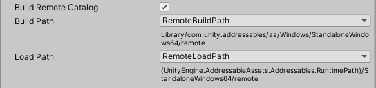
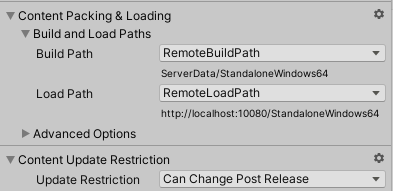
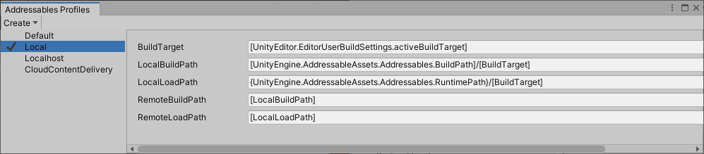
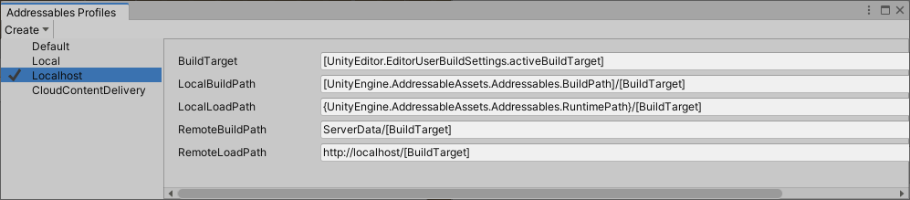
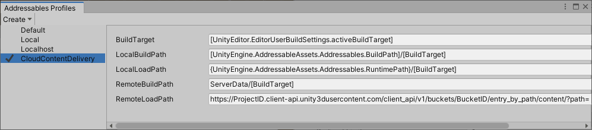

# Remote content distribution

远程分发内容可以减少初始应用程序下载大小和安装时间。您还可以更新远程分布式资产，而无需重新发布您的应用或游戏

当您指定远程 URL 作为组的加载路径时，Addressables 系统将从该 URL 加载组中的资产。当您启用 Build Remote Catalog 选项时，Addressables 会在远程目录中查找任何远程资产的地址，从而允许您对 Addressable 资产进行更改，而无需强制用户更新和重新安装整个游戏或应用程序。

[enabling remote distribution](https://docs.unity3d.com/Packages/com.unity.addressables@1.19/manual/RemoteContentDistribution.html#enabling-remote-distribution)后，你可以建立在两个方面内容：

- 使用**New Build > Default Build Script**的完整[content build](https://docs.unity3d.com/Packages/com.unity.addressables@1.19/manual/Builds.html)：构建所有内容包和目录。在准备发布或更新完整应用程序时，始终在重建播放器之前执行完整构建。
- 使用**Update a Previous Build**脚本的 [content update build](https://docs.unity3d.com/Packages/com.unity.addressables@1.19/manual/ContentUpdateWorkflow.html)：构建所有内容包和目录，但设置远程目录，以便安装的应用程序只需要下载更改的包。运行 **[Check for Content Update Restrictions](https://docs.unity3d.com/Packages/com.unity.addressables@1.19/manual/ContentUpdateWorkflow.html#check-for-content-update-restrictions-tool)**工具以识别更改并在构建更新之前准备您的组。

构建完整构建或更新后，您必须将远程目录、目录哈希文件和远程捆绑包上传到您的托管服务。

有关设置可寻址配置文件以帮助您开发、测试和发布远程内容的提示，请参阅 [Using Profiles to aid development](https://docs.unity3d.com/Packages/com.unity.addressables@1.19/manual/RemoteContentDistribution.html#using-profiles-to-aid-development)。

## Enabling remote distribution

要启用内容的远程分发，您必须启用远程目录并设置包含要远程托管的资产的组。

### Enabling the remote catalog

在您的**Addressable Asset Settings**检查器（菜单：**Window > Asset Management > Addressables > Settings**）中启用远程目录。

- **Build Remote Catalog**：启用
- **Build Path**：远程构建路径
- **Load Path**：远程加载路径

*Enabling the remote catalog*

目录及其随附的哈希文件构建到由**Build Path**设置指定的文件夹。您必须上传这些文件，以便可以通过您的**Load Path**设置指定的 URL 访问它们。除非您有特定原因不这样做，否则请使用活动配置文件中的**RemoteBuildPath**和**RemoteLoadPath**变量，以便将目录构建到与远程包相同的路径并从相同的路径加载。

### Setting up a remote group

要设置组以便远程托管其中的资产，请使用**RemoteBuildPath**和**RemoteLoadPath**配置文件变量设置 **Build** 和 **Load Paths** ：

如果您计划在发布应用程序的完全重建之间发布内容更新，请根据您希望更新组中内容的频率设置**Update Restriction**值。

为生成较大捆绑包的组选择**Cannot Change Post Release**，尤其是当您预计不会更改组中的大部分资产时。如果使用此设置更改组中的资产，可寻址工具将更改的资产移动到新组以进行更新。安装的应用程序只会下载新的包。

为包含您希望经常更改的资产的组选择**Can Change Post Release**。如果您使用此设置更改组中的资产，则包含这些资产的捆绑包将作为一个整体重新构建，并将由已安装的应用程序重新下载。要减少更新后需要下载的数据量，请尝试使使用此设置的组生成的包尽可能小。

有关更新远程内容的更多信息，请参阅[Content update builds](https://docs.unity3d.com/Packages/com.unity.addressables@1.19/manual/ContentUpdateWorkflow.html)。

在**Advanced Options**部分包含了影响远程主机和下载（但不必启用远程主机）的一些选项。有关详细信息，请参阅[Advanced Options](https://docs.unity3d.com/Packages/com.unity.addressables@1.19/manual/GroupSettings.html#advanced-options)。

## Using Profiles to aid development

一个[Profile](https://docs.unity3d.com/Packages/com.unity.addressables@1.19/manual/AddressableAssetsProfiles.html)定义的变量，你可以用它来设置生成和负载路径，为您的本地和远程内容。

当您远程分发内容时，您通常需要为您的远程内容设置不同的 URLS（加载路径），具体取决于您进行构建的原因。此类情况的一些示例包括：

**Builds for testing general game play and function**

在开发早期或当您需要在不访问主机的情况下进行测试时，您可能会发现将所有内容视为本地内容很方便。对于这种情况，您可以创建一个配置文件，使用与本地内容相同的路径构建和加载远程内容。

*All content treated as local*

**Builds for local hosting**

稍后，当您在本地网络（或 localhost）上设置主机时，您需要更改远程组的加载路径以反映主机的 URL。您可以专门针对这种情况创建一个新的配置文件，而不是编辑现有的配置文件或组设置。

*Remote content served from localhost URL*

**Builds for CDN**

当您接近生产时，您可能会使用临时服务器，然后使用您的生产内容交付网络 (CDN)。您可以为这些情况中的每一种创建配置文件。

*Remote content hosted on the Unity Cloud Content Delivery service*

**Other**

即使在发布之后，您也可能希望使用不同的主机 URL 进行 Beta 测试或其他目的。

无需在每次构建时手动配置构建和加载路径，您可以创建不同的配置文件并适当设置变量。然后，您可以在构建内容之前轻松地在配置文件之间切换，而不必担心路径配置错误。

如果您使用脚本来启动您的内容构建，那么您可以使用 Addressables API 为构建选择特定的配置文件。请参阅 [Starting an Addressables build from a script](https://docs.unity3d.com/Packages/com.unity.addressables@1.19/manual/BuildPlayerContent.html#starting-an-addressables-build-from-a-script)。

如果您有复杂的 URL，您可以在构建或运行时评估的 Profile 变量中引用静态字段或属性。例如，您可以创建一个 Editor 类，将信息作为静态属性提供，并将其引用为 [CCDInfo.ProjectID]，而不是将您的 CCD ProjectID 作为字符串输入。有关详细信息，请参阅[Profile variable syntax](https://docs.unity3d.com/Packages/com.unity.addressables@1.19/manual/AddressableAssetsProfiles.html#profile-variable-syntax)。（[InternalIdTransformFunc](https://docs.unity3d.com/Packages/com.unity.addressables@1.19/manual/TransformInternalId.html)函数提供了一种处理复杂 URL 要求的附加方法。）

## AssetBundle caching

默认情况下，为可寻址构建生成的 AssetBundle 在下载后缓存在客户端设备上。缓存包只有在更新或从缓存中删除时才会再次下载。

更新的目录可以排除旧版本目录中存在的捆绑条目。当这些条目被缓存时，设备上不再需要它们的数据。

当设备上有不需要的缓存数据时，您可以选择以下三个选项之一：

- 要删除整个包缓存，请使用[Caching.ClearCache](https://docs.unity3d.com/2019.4/Documentation/ScriptReference/Caching.ClearCache.html)。
- 要随时删除不再引用的缓存条目，请使用[Addressables.CleanBundleCache](https://docs.unity3d.com/Packages/com.unity.addressables@1.19/api/UnityEngine.AddressableAssets.Addressables.CleanBundleCache.html)。您通常在初始化 Addressables（参见 [Customizing Addressables initialization](https://docs.unity3d.com/Packages/com.unity.addressables@1.19/manual/InitializeAsync.html)）或加载其他目录（参见 [Managing catalogs at runtime](https://docs.unity3d.com/Packages/com.unity.addressables@1.19/manual/LoadContentCatalogAsync.html)）之后调用此函数。
- 自动调用[Addressables.CleanBundleCache](https://docs.unity3d.com/Packages/com.unity.addressables@1.19/api/UnityEngine.AddressableAssets.Addressables.CleanBundleCache.html)更新目录后，在[Addressables.UpdateCatalogs](xref:UnityEngine.AddressableAssets.Addressables.UpdateCatalogs(System.Boolean,System.Collections.Generic.IEnumerable{System.String},System.Boolean))使用该参数`autoCleanBundleCache`。有关示例脚本，请参阅 [Checking for content updates at runtime](https://docs.unity3d.com/Packages/com.unity.addressables@1.19/manual/ContentUpdateWorkflow.html#checking-for-content-updates-at-runtime)。

如果禁用组的缓存，则为该组生成的远程包在下载时存储在内存中，直到您卸载它们或应用程序退出。下次应用程序加载包时，Addressables 会再次下载它。

您可以使用组检查器 [Advanced Options](https://docs.unity3d.com/Packages/com.unity.addressables@1.19/manual/GroupSettings.html#advanced-options) 下的 **Use Asset Bundle Cache** 设置来控制是否缓存组生成的包。

有关 AssetBundle 缓存的其他信息，请参阅 [AssetBundle compression](https://docs.unity3d.com/2019.4/Documentation/Manual/AssetBundles-Cache.html)。Addressables 系统根据组设置设置它用于下载可寻址包的[UnityWebRequests](https://docs.unity3d.com/2019.4/Documentation/ScriptReference/Networking.UnityWebRequest.html)的缓存相关参数。

请注意，WebGL AssetBundles 有一些限制。有关更多信息，请参阅 [Building and running a WebGL project](https://docs.unity3d.com/2019.4/Documentation/Manual/webgl-building.html#AssetBundles)。

## Pre-downloading remote content

在您想要预下载内容以便将其缓存在磁盘上并在应用程序需要时更快地访问的情况下，您可以使用[Addressables.DownloadDependenciesAsync](https://docs.unity3d.com/Packages/com.unity.addressables@1.19/api/UnityEngine.AddressableAssets.Addressables.DownloadDependenciesAsync.html) 方法。此方法下载可寻址实体和任何依赖项作为后台任务。

调用[Addressables.DownloadDependenciesAsync](https://docs.unity3d.com/Packages/com.unity.addressables@1.19/api/UnityEngine.AddressableAssets.Addressables.DownloadDependenciesAsync.html)方法加载您传入的地址或标签的依赖项。通常，这是 AssetBundle。

此调用返回的[AsyncOperationHandle](https://docs.unity3d.com/Packages/com.unity.addressables@1.19/api/UnityEngine.ResourceManagement.AsyncOperations.AsyncOperationHandle.html)结构包含一个 PercentComplete 属性，可用于监视和显示下载进度。您还可以让应用程序等待内容加载完毕。

### Regarding PercentComplete

PercentComplete 考虑了由单个 AsyncOperationHandle 处理的底层操作的多个方面。在某些情况下，进展不是线性的，或者是线性的。这可能是因为快速操作的权重与需要更长时间的操作的权重相同。

例如，假设您希望从远程位置加载一个需要花费大量时间来下载并依赖本地包作为依赖项的资产，您将看到 PercentComplete 在继续之前跃升至 50%。这是因为本地包的加载速度比远程包快得多。但是，系统只知道需要两个操作才能完成。

如果您希望在下载前征得用户同意，请使用[Addressables.GetDownloadSize](https://docs.unity3d.com/Packages/com.unity.addressables@1.19/api/UnityEngine.AddressableAssets.Addressables.GetDownloadSize.html)返回从给定地址或标签下载内容所需的空间。请注意，这考虑了任何先前下载的仍在 Unity 的 AssetBundle 缓存中的包。

虽然提前为您的应用下载资产可能是有利的，但在某些情况下您可能会选择不这样做。例如：

- 如果您的应用包含大量在线内容，并且您通常希望用户只与其中的一部分进行交互。
- 您有一个必须在线连接才能运行的应用程序。如果您的应用程序的所有内容都打包成小包，您可以根据需要选择下载内容。

您可以使用预加载功能显示下载已开始，然后继续，而不是使用完成百分比值来等待内容加载完毕。此实现将需要一个加载或等待屏幕来处理在需要时资产尚未完成加载的实例。

## Custom URL evaluation

在多种情况下，您可能需要在运行时自定义资产（通常为 AssetBundle）的路径或 URL。最常见的示例是创建签名 URL。另一个是动态主机确定。

有关详细信息，请参阅[ID transform function](https://docs.unity3d.com/Packages/com.unity.addressables@1.19/manual/TransformInternalId.html)。

## Content catalogs

内容目录是 Addressables 用于根据提供给系统的密钥查找资产物理位置的数据存储。默认情况下，Addressables 为所有 Addressable 资产构建单个目录。当您构建应用程序播放器时，目录将放置在 StreamingAsset 文件夹中。本地目录可以访问远程和本地资产，但如果您想在应用程序的完整构建之间更新内容，您还必须启用 [Build Remote Catalogs](https://docs.unity3d.com/Packages/com.unity.addressables@1.19/manual/AddressableAssetSettings.html#catalog)选项。

远程目录是与远程内容一起托管的目录的单独副本。最终，Addressables 只使用这些目录之一。如果构建了远程目录并且它具有与本地目录不同的哈希值，则会下载、缓存并使用它来代替内置本地目录。当您生成[content update build](https://docs.unity3d.com/Packages/com.unity.addressables@1.19/manual/ContentUpdateWorkflow.html)，哈希会更新，并且新的远程目录指向任何更新资产的更改版本。

**NOTE**

*您必须为您发布的完整播放器构建启用远程目录。否则，Addressables 系统不会检查远程目录，因此无法检测任何内容更新。请参阅 [Enabling the remote catalog](https://docs.unity3d.com/Packages/com.unity.addressables@1.19/manual/RemoteContentDistribution.html#enabling-the-remote-catalog)。*

## Loading additional catalogs

但是，可以指定要加载的其他内容目录。您可能会出于多种原因决定加载其他目录适合您的项目，例如构建您想要在不同项目中使用的纯艺术项目。

如果您发现加载其他目录适合您，有一种方法可以在这方面提供帮助，LoadContentCatalogAsync。

对于 LoadContentCatalogAsync，您只需提供要加载的目录的位置即可。但是，这本身并不会使用目录缓存，因此如果您从远程位置加载目录，请务必小心。每次需要加载该目录时，都会产生 WebRequest。

为了帮助您避免每次都需要下载远程目录，如果您在加载的目录旁边提供带有目录哈希的 .hash 文件，我们可以使用它来正确缓存您的内容目录。

**NOTE**

- 哈希文件确实需要与您的目录位于相同的位置并具有相同的名称。路径的唯一区别应该是扩展名。
- 您会注意到此方法带有一个参数 autoReleaseHandle。为了让系统下载新的远程目录，需要释放任何先前对 LoadContentCatalogAsync 指向您尝试加载的目录的调用。否则，系统会从我们的操作缓存中选取内容目录加载操作。如果选择了缓存操作，则不会下载新的远程目录。如果设置为 true，参数 autoReleaseHandle 可以确保操作完成后不会留在我们的操作缓存中。

