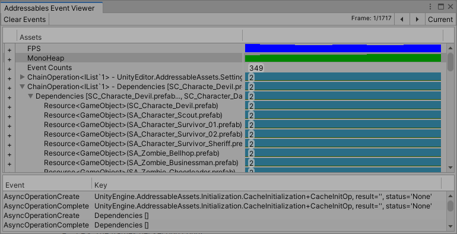
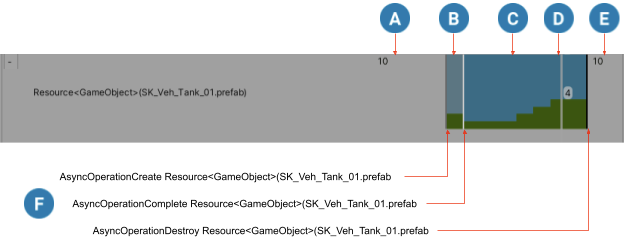

# Event Viewer

使用**Addressables Event Viewer**窗口来监视可寻址资产的内存管理。该窗口显示您的应用程序何时加载和卸载资产，并显示所有可寻址系统操作的引用计数。该窗口还显示了应用程序帧速率和分配的托管内存总量的大致视图。您可以使用这些图表来检测 Addressables 事件（例如加载和释放资产）如何影响应用程序性能并检测您从未释放的资产。

使用**Use Existing Build**播放模式”脚本在“播放”模式下的事件查看器中获取最准确的信息。在**Use Asset Database**脚本不占资产及当中的任何共享的依赖**Simulate Groups**脚本给的引用计数不那么准确的监测。

**IMPORTANT**

*在事件查看器中查看数据，您必须在[AddressableAssetSettings](https://docs.unity3d.com/Packages/com.unity.addressables@1.19/api/UnityEditor.AddressableAssets.Settings.AddressableAssetSettings.html)对象的检查器中启用**Send Profiler Events**设置并构建新的内容。*

有关管理与可寻址资产关联的内存的更多信息，请参阅 [Memory management](https://docs.unity3d.com/Packages/com.unity.addressables@1.19/manual/MemoryManagement.html) 。

## Viewing Addressables events

在**Event Viewer**窗口中查看可寻址资产寿命图表和事件：

1. 在您的可寻址设置中启用**Send Profiler Events**：打开您的可寻址设置检查器（菜单：**Window > Asset Management > Addressables > Settings**） b. 在**Diagnostics** 下，选中**Send Profiler Events**选项。
2. 使用Addressables Groups 窗口中的**Default Build Script**重建您的 Addressables 内容。
3. 打开**Event Viewer**（菜单：**Window > Asset Management > Addressables > Event Viewer**）。
4. 在编辑器中进入播放模式。

## Viewing Addressables events in a standalone player

要将事件查看器连接到独立播放器，请按照 [Viewing Addressables Events](https://docs.unity3d.com/Packages/com.unity.addressables@1.19/manual/EventViewer.html#viewing-addressables-events)下的步骤进行操作，除了在编辑器中进入播放模式的最后一步。相反，请执行以下附加步骤：

1. 打开**Build Settings**窗口（菜单：**File > Build Settings**）。
2. 检查**Development Build**选项。
3. 选中**Autoconnect Profiler**选项。
4. 打开 Unity **Profiler __window（菜单：__Window > Analysis > Profiler**）。
5. 在“构建设置”窗口中，单击  **Build and Run**。

事件查看器会自动连接到您的独立播放器并显示发生的可寻址事件。

有关使用 Unity Profiler 的更多信息，请参阅[Profiler overview](https://docs.unity3d.com/2019.4/Documentation/Manual/Profiler.html)。

## Event Viewer window

要访问编辑器中的窗口，请选择**Window** > **Asset Management** > **Addressables** > **Event Viewer**。

*The Event Viewer window*

该窗口分为三个部分：

- 工具栏：
  - **Clear Events**按钮：清除所有记录的帧，擦除窗口中的所有内容。
  - **Unhide All Hidden Events**：将您隐藏的任何资产或操作生命线返回到它们的正常显示状态。仅在您有隐藏事件时显示。
  - **Frame** 计数器：显示帧光标的位置和记录的帧数。（如果工具栏没有显示 **Frame** 计数器，则帧光标位于当前帧。）
  - 帧步长 ( **<>** ) 按钮：在记录的帧中步进帧光标。（您也可以使用键盘箭头键。）
  - **Current** 按钮：将帧光标移动到当前帧。
- **Assets** 显示：显示与可寻址操作和资产相关的分析器和生命周期图表。
  - **FPS**图表：应用程序帧率。
  - **MonoHeap**图表：正在使用的托管内存量。
  - **Event Counts**：帧中发生的可寻址事件的数量（查看**事件**列表中的**事件**）。
  - **Instantiation Counts**：一个帧中对[Addressables.InstantiateAsync](https://docs.unity3d.com/Packages/com.unity.addressables@1.19/api/UnityEngine.AddressableAssets.Addressables.InstantiateAsync.html)的调用次数。
  - 操作和资产寿命图表：显示系统何时加载和释放操作或资产并显示引用计数。请参阅[资产寿命图表](https://docs.unity3d.com/Packages/com.unity.addressables@1.19/manual/EventViewer.html#asset-lifespan-chart)。
- ***Event** 列表：显示帧中发生的可寻址操作事件。

您可以单击窗口的图表区域来暂停您的应用程序并设置**frame cursor**的位置。框架光标在窗口中显示为一条垂直线，并显示所选框架的摘要信息。

**NOTE**

FPS 和 MonoHeap 图表包括影响性能的所有因素，而不仅仅是与可寻址资产相关的因素。

## Asset lifespan chart

资产生命周期图表显示资产或操作的创建时间、当前引用计数以及销毁时间。

要展开显示资产或操作生命周期的显示行，请单击 **Assets** 列表中条目的**+**按钮。

要查看条目的子操作或子资产，请单击父对象的展开图标 ( **>** )。

您可以通过右键单击资产或操作的生命线并在上下文菜单上选择**Hide Selected Events**来从图表中删除资产或操作的生命线。单击工具栏上的**Unhide All Hidden Events**按钮以显示任何隐藏事件的生命线。

*An example asset lifespan and the related Addressables events*

寿命图表显示以下信息：

在加载资产之前（不显示)。

资产加载正在进行中（暗蓝色)。

资产已加载（蓝色)。绿色条显示资产的当前引用计数。

事件查看器帧光标，显示所选帧的信息，在这种情况下，光标指示此资产在所选帧期间的引用计数为 4。

资产被销毁并卸载后（无显示)。

与特定帧关联的事件（事件仅显示在帧光标的位置)。