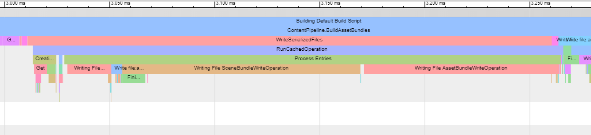

# Build Profiling

Addressables 构建过程始终创建一个 .json 日志文件，其中包含构建性能信息。您可以在项目文件夹中的`Library/com.unity.addressables/AddressablesBuildTEP.json`.

在 Google Chrome 或其他基于[Chromium](https://www.chromium.org/Home)的浏览器中使用 chrome://tracing 工具查看日志文件。

*A sample log file displayed in chrome://tracing*

**To view the build profile:**

1. 打开基于[Chromium](https://www.chromium.org/Home)的浏览器。
2. 在浏览器中输入[chrome://tracing](chrome://tracing/)以打开[Trace Event Profiling Tool](https://www.chromium.org/developers/how-tos/trace-event-profiling-tool)。
3. 单击**Load** 按钮。
4. 在文件浏览器中，导航到 Unity 项目的`Library/com.unity.addressables`文件夹。
5. 打开`AddressablesBuildTEP.json`文件。

有关构建性能日志记录的更多信息，请参阅[Unity Scriptable Build Pipeline](https://docs.unity3d.com/Packages/com.unity.scriptablebuildpipeline@latest)。